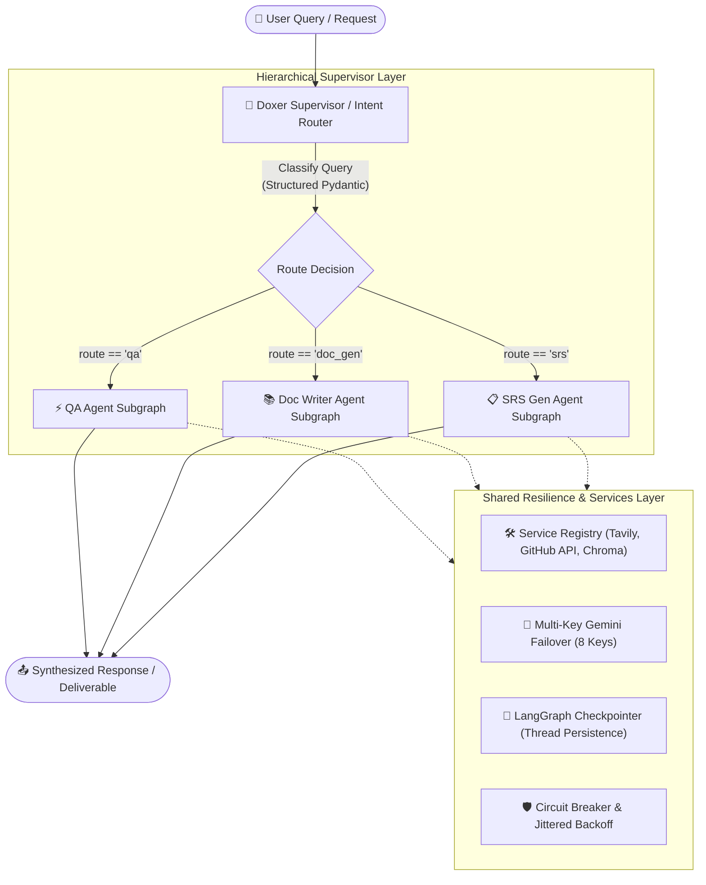
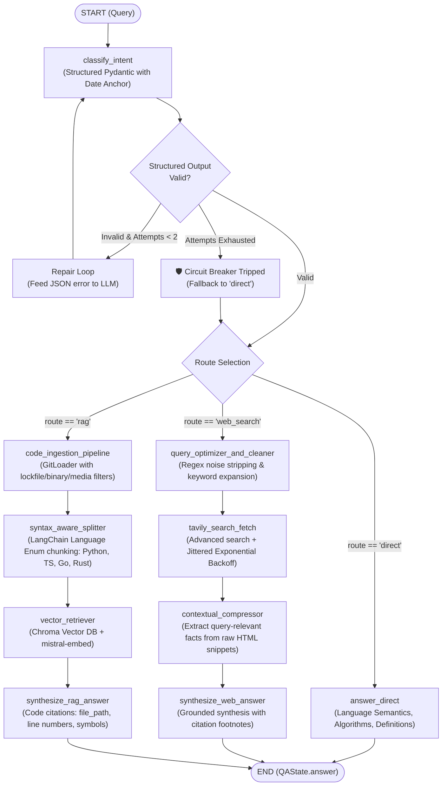
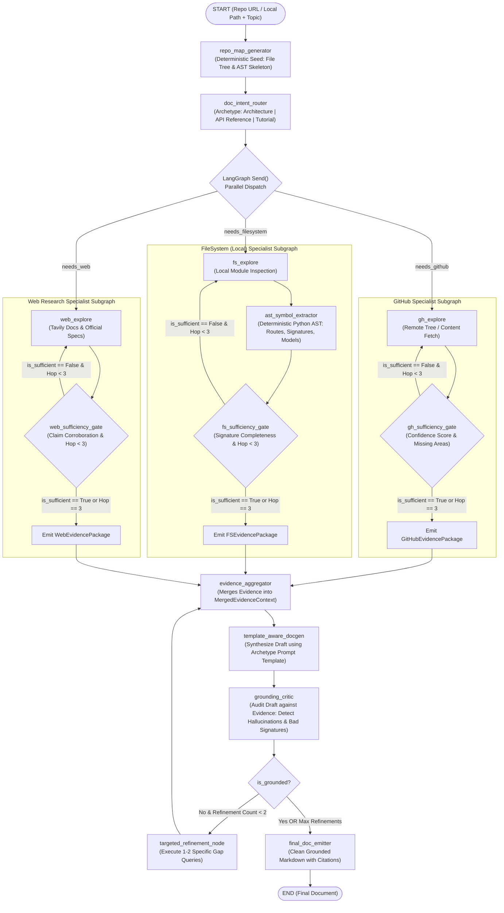
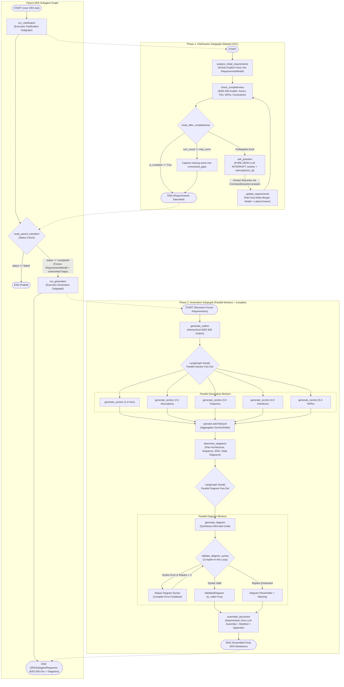

# Doxer AI — Autonomous Multi-Agent Documentation & Engineering Intelligence Assistant

> **Doxer AI** is a multi-agent documentation assistant built for software engineers. Ask it to write a setup guide, explain part of a codebase, answer a technical question, or generate a complete IEEE 830-compliant Software Requirements Specification (SRS) — it decides whether to pull live info from the web, analyze a GitHub repo file-by-file, retrieve relevant code via RAG, or run a full requirements-gathering conversation before producing a structured doc with diagrams. Built with **LangGraph** for multi-agent orchestration and **LangSmith** for tracing and evaluation.

---

## 🏛️ Complete System Architecture

Doxer AI is organized as a **Hierarchical Supervisor Multi-Agent System**. Rather than relying on a single monolithic graph that suffers from state pollution, context explosion, and tightly coupled failure modes, the system employs a top-level **Supervisor / Doxer Agent** that orchestrates three independent, bounded subgraphs.



---

### 1. In-Depth Architecture: QA Agent Subgraph
*(Implementation: [1_simple_search_agent.ipynb](file:///D:/Projects/DevDocs%20AI/1_simple_search_agent.ipynb), [2_agent_with_git_rag.ipynb](file:///D:/Projects/DevDocs%20AI/2_agent_with_git_rag.ipynb))*

The **QA Agent** provides ultra-fast technical answers, live web intelligence, and syntax-aware codebase retrieval. It is hardened against LLM schema failures via an automated repair loop and circuit-breaker fallback.



**Key QA Agent Internals:**
- **`QAState` Schema:** Tracks `query`, `route` (`direct` | `web_search` | `rag`), `max_results`, `search_results`, `retrieved_chunks` (with file path, chunk content, and similarity score), and `answer`.
- **Dynamic File Ingestion Filter:** Automatically screens repositories against 3 exclusion layers:
  1. *Directory Exclusions:* `.git`, `node_modules`, `venv`, `__pycache__`, `dist`, `build`, etc.
  2. *Lockfile & Junk Exclusions:* `package-lock.json`, `poetry.lock`, `yarn.lock`, `.DS_Store`.
  3. *Binary & Media Probing:* Rejects images, compiled binaries (`.so`, `.pyc`, `.dll`), PDFs, archives, and files with null bytes (`\x00`).
- **Resilience Layer:** Exponential backoff with random uniform jitter (`base * 2^attempt + jitter`), preventing API rate-limit spikes (HTTP 429).

---

### 2. In-Depth Architecture: Doc Writer Agent Subgraph (Architecture D)
*(Implementation: [3_docgen_sub_agent.ipynb](file:///D:/Projects/DevDocs%20AI/3_docgen_sub_agent.ipynb))*

The **Doc Writer Agent** implements **Architecture D: Hierarchical Supervisor with Bounded, Sufficiency-Gated Subgraphs + Grounding Critique**. It prevents unbounded wandering by pairing deterministic repository mapping with bounded multi-hop specialists and an independent grounding auditor.



**Key DocGen Agent Internals:**
- **Deterministic Seed Node (`repo_map_generator`):** Builds a structural directory map and file inventory without LLM calls, providing the router with ground-truth orientation.
- **`APIEndpointSymbol` Contract:** Uses Python's native `ast` module to extract exact function signatures, argument types, return annotations, route decorators (e.g. `@router.get("/v1/items")`), and docstrings.
- **Typed Evidence Packages:** `GitHubEvidencePackage`, `FSEvidencePackage`, and `WebEvidencePackage` standardize facts, code blocks, and source URLs into `MergedEvidenceContext`.
- **Grounding Critic & Refinement Loop:** Classifies detected discrepancies into `hallucination`, `incorrect_signature`, `unsupported_assertion`, or `missing_reference`. Generates precision queries for targeted gap-filling before publishing.

---

### 3. In-Depth Architecture: SRS Generation Subagent (Architecture B)
*(Implementation: [3_srs_sub_agent.ipynb](file:///D:/Projects/DevDocs%20AI/3_srs_sub_agent.ipynb))*

The **SRS Generator Agent** implements **Architecture B: Two-Phase Composed Subgraphs (Clarification Subgraph + Generation Subgraph)** aligned with IEEE 830-1998 standards. It isolates stateful conversational turn tracking from parallel document drafting.



**Key SRS Agent Internals:**
- **Zero-LLM Interrupt Invariant:** `ask_question` does not invoke an LLM. It simply calls `interrupt(next_question)`. When the human resumes the graph with `Command(resume=answer)`, zero redundant tokens are spent re-evaluating questions.
- **Flat-Cost Delta Requirements Merging (`update_requirements`):** Eliminates $O(N^2)$ conversation context burn. Only the current `RequirementsModel` and the single latest question-answer pair are fed to the model, keeping token consumption completely constant per turn.
- **Compiler-in-the-Loop Diagram Repair:** Validates all generated Mermaid / PlantUML code against parsers with up to 3 repair cycles. Broken code is never silently dumped into the output.
- **Deterministic Document Assembler (`assemble_document`):** A non-LLM Python assembler stitches section drafts in outline order, embeds valid diagrams, inserts diagram manifest tables, and appends an **Ambiguity Registry Appendix** documenting unresolved gaps for engineering risk management.

---

## 🏗️ How It Was Built in Phases

The Doxer AI platform was developed incrementally following structured blueprints ([Sprinter_Implementation_Plan.md](file:///D:/Projects/DevDocs%20AI/Sprinter_Implementation_Plan.md), [SRS_Subgraph_Implementation_Plan.md](file:///D:/Projects/DevDocs%20AI/SRS_Subgraph_Implementation_Plan.md), and [DocGen_Subgraph_Implementation_Plan.md](file:///D:/Projects/DevDocs%20AI/DocGen_Subgraph_Implementation_Plan.md)). Each phase added exactly one new axis of complexity:

```
┌──────────────────────────────────────────────────────────────────────────────────┐
│ SPRINTER MASTER ROADMAP                                                          │
├──────────────────────────────────────────────────────────────────────────────────┤
│ Phase 1:  Bare-Bones QA Skeleton & LangSmith Tracing Setup                      │
│ Phase 2:  2-Way Intent Tool Routing (Direct vs. Web Search) + Repair Loops       │
│ Phase 3:  3-Way Intent Router + AST-Aware Code Ingestion & Git Vector RAG        │
│ Phase 4:  Production Hardening: Jitter, Retries, Graceful Circuit Breaker        │
│ Phase 5:  GitHub Repo Tree Analyzer (Standalone Map-Reduce Fan-Out via Send())   │
│ Phase 6:  DocGen Subgraph: Multi-Source Synthesis & Citation Tracking            │
│ Phase 7:  Top-Level Supervisor Graph: Unified Router + State Checkpointing       │
│ Phase 8:  SRS Subagent Part 1: Stateful Requirements Clarification Loop (HITL)   │
│ Phase 9:  SRS Subagent Part 2: Section Drafting, Diagram Compilers & Assembler   │
│ Phase 10: Composed Multi-Agent System Integration & Service Registry             │
│ Phase 11: Quantitative Evaluation Pipeline (LangSmith Datasets & Custom Rubrics) │
│ Phase 12: Production Hardening & Resilience Layer                                │
└──────────────────────────────────────────────────────────────────────────────────┘
```

### Component Evolution Across Implementations

#### 1. QA Agent Evolution ([1_simple_search_agent.ipynb](file:///D:/Projects/DevDocs%20AI/1_simple_search_agent.ipynb), [2_agent_with_git_rag.ipynb](file:///D:/Projects/DevDocs%20AI/2_agent_with_git_rag.ipynb))
- **Phase 1 (Linear QA):** Baseline `START -> answer_node -> END` with LangSmith tracing verification.
- **Phase 2 (Web Augmented):** Structured Pydantic `IntentClassification` routing queries between direct answer and Tavily search with temporal date anchoring (`CURRENT_DATE`). Added Regex boilerplate cleaning and contextual snippet compression.
- **Phase 3 (Git Code RAG):** Expanded router to a 3-way enum (`direct`, `web_search`, `rag`). Implemented `CodeIngestionPipeline` with GitLoader, automated exclusion rules (ignoring `.git`, `node_modules`, lockfiles, binary files, and media), syntax-aware splitting via `Language` enum, and Chroma vector search with `mistral-embed`.
- **Phase 4 (Resilience):** Implemented multi-attempt self-repair loops for structured outputs, jittered exponential backoff for rate limits, and an automated Circuit Breaker defaulting safely to `DIRECT` on unrecoverable validation failures.

#### 2. DocGen Subgraph Evolution ([1_docgen_sub_agent.ipynb](file:///D:/Projects/DevDocs%20AI/1_docgen_sub_agent.ipynb), [2_docgen_sub_agent.ipynb](file:///D:/Projects/DevDocs%20AI/2_docgen_sub_agent.ipynb), [3_docgen_sub_agent.ipynb](file:///D:/Projects/DevDocs%20AI/3_docgen_sub_agent.ipynb))
- **Phase 1 (Linear DocGen):** Single compiled graph with direct MCP tool routing across GitHub, local filesystem, and Tavily search.
- **Phase 2 (Sufficiency-Gated Specialists):** Decoupled exploration into three isolated specialist subgraphs triggered via LangGraph `Send()`. Introduced bounded hop counters and typed `SufficiencyCheck` gates (confidence score + missing info checks) to eliminate unbounded directory wandering. Emitted typed evidence packages into an `evidence_aggregator`.
- **Phase 3 (Architecture D Hardening):** Deterministic Python AST symbol extractor (`APIEndpointSymbol`) for route handlers, classes, and decorators; archetype-specific prompt generation (`architecture_explainer`, `api_reference`, `tutorial_quickstart`); and an automated `grounding_critic` performing claim-by-claim audits with bounded 1–2 hop targeted refinement loops before final emission.

#### 3. SRS Generation Subagent Evolution ([1_srs_sub_agent.ipynb](file:///D:/Projects/DevDocs%20AI/1_srs_sub_agent.ipynb), [2_srs_sub_agent.ipynb](file:///D:/Projects/DevDocs%20AI/2_srs_sub_agent.ipynb), [3_srs_sub_agent.ipynb](file:///D:/Projects/DevDocs%20AI/3_srs_sub_agent.ipynb))
- **Phase 1 (Clarification Engine):** Standalone stateful HITL graph (`clarification_graph`) featuring IEEE 830 `RequirementsModel`, completeness auditor (`check_completeness`), zero-LLM interrupt node (`ask_question`), and flat-cost delta merger (`update_requirements`).
- **Phase 2 (Generation Engine):** Standalone generative graph (`generation_graph`) featuring outline planning, parallel section workers via `Send()`, diagram synthesizer with automated Mermaid syntax validator & compiler-in-the-loop repair, and a non-agentic document assembler (`assemble_document`) with diagram manifests and ambiguity registers.
- **Phase 3 (Two-Phase Subgraph Composition):** Unified parent graph (`parent_srs_graph`) composing clarification and generation subgraphs behind a strict boundary contract, supporting parent checkpointer inheritance and emitting typed `SRSSubagentResponse` payloads for supervisor integration.

---

## ⚡ Real-World Challenges Faced & Architectural Solutions

Building an autonomous multi-agent engineering assistant exposes failure modes that theoretical architectures miss. Below are the core challenges encountered during real-world implementation and how Doxer AI resolves them:

### 1. The RAG vs. Full File Analysis Dilemma (The Hybrid Approach)
- **Challenge:** Should we use vector RAG or analyze every file for document generation and ad-hoc questions?
  - For normal questions (e.g., *"Where is JWT authentication verified?"*), vector RAG over code chunks is fast and accurate.
  - However, for holistic document generation (e.g., *"Generate an architectural overview of our order processing service"*), naive RAG fails catastrophically: semantic search returns scattered code snippets but misses high-level architecture, directory layout, and inter-module dependencies. Conversely, analyzing every file burns tens of thousands of tokens and exceeds model context windows.
- **Solution — The Hybrid Approach:**
  1. For ad-hoc QA, use AST/Language-aware vector RAG.
  2. For document generation, use a deterministic seed: generate a lightweight repository map and file tree, feed it to a structured planner, and dispatch isolated specialist agents with bounded sufficiency gates to read only the vital files and AST signatures.

### 2. The LangGraph `interrupt()` Replay Token Burn
- **Challenge:** In LangGraph, when a node calls `interrupt()` to wait for human input, resuming the graph with `Command(resume=...)` replays the interrupted node from the beginning. If question generation and human interruption share the same node, every human reply triggers a redundant, expensive LLM question-generation call, wasting tokens, increasing latency, and introducing prompt drift.
- **Solution — Zero-LLM Interrupt Pattern:**
  - Decouple question generation from the interrupt node. The auditor node (`check_completeness`) determines missing dimensions and precomputes `next_question`.
  - The interrupt node (`ask_question`) is a pure Python node that does **no LLM call**—it only calls `interrupt(next_question)`. On resumption, the node simply captures the human's response and passes it forward.

### 3. Quadratic $O(N^2)$ Context Explosion in Clarification Sessions
- **Challenge:** In iterative requirements gathering, naive implementations append the entire conversation history to the prompt on every turn. Over a 5–8 turn session, token consumption grows quadratically ($O(N^2)$), running into context limits and degrading model attention.
- **Solution — Flat-Cost Delta Requirements Merging:**
  - Rather than re-parsing the entire chat log, the `update_requirements` node takes only two inputs: the current structured `RequirementsModel` and the single latest question-and-answer pair.
  - The model performs a targeted delta-merge, keeping per-turn prompt size constant and flat.

### 4. Diagram Syntax Fragility & Hallucinations
- **Challenge:** LLMs frequently produce broken Mermaid or PlantUML diagrams—using unescaped brackets in node labels (`[User (Admin)]`), invalid arrow links, or hallucinated syntax keywords. If unvalidated, broken diagram code renders as an ugly error block in user-facing documentation.
- **Solution — Compiler-in-the-Loop Validation & Repair:**
  - Every diagram generated by the diagram worker is parsed and validated against syntax rules.
  - On syntax failure, the compiler error is returned to the model in a bounded repair loop (up to 3 attempts).
  - If repair attempts are exhausted, the assembler gracefully inserts an informative diagram placeholder and audit warning rather than crashing the document.

### 5. Multi-Key Quota Exhaustion & Rate-Limit Throttling (HTTP 429)
- **Challenge:** Multi-agent workflows with parallel `Send()` fan-outs make multiple simultaneous LLM calls. Free or rate-limited API tiers (Google Gemini, Mistral, OpenRouter) frequently throw HTTP 429 `RESOURCE_EXHAUSTED` errors mid-run, breaking the execution graph.
- **Solution — Multi-Key Failover & Concurrency Semaphores:**
  - Implemented `MultiKeyGeminiLLM`: a thread-safe LangChain LLM wrapper that pools multiple API keys (`GOOGLE_API_KEY_1` through `GOOGLE_API_KEY_8`) and automatically rotates to the next healthy key upon encountering a 429 or quota limit.
  - Added concurrency semaphores (`asyncio.Semaphore(1)`) with exponential backoff buffers to space out rapid parallel calls.

### 6. Synchronized Retries & Thundering Herd (Jitter)
- **Challenge:** When external APIs fail or return rate limits, fixed-interval retries cause all failed parallel workers to retry simultaneously, hitting the API at the exact same millisecond and re-triggering 429 errors.
- **Solution — Jittered Exponential Backoff:**
  - Added randomized jitter to retry calculations: `delay = base_delay * (2 ** attempt) + random.uniform(0.1, 0.5)`. Adding random variation to retry timing prevents synchronized spikes and ensures smooth request recovery.

### 7. Structured Output Fragility & Cascading Failures (Circuit Breakers)
- **Challenge:** In multi-step agent graphs, an LLM occasionally outputs invalid JSON or omits a required Pydantic field. If an unhandled exception is raised, the entire state machine crashes, losing all progress across previous nodes.
- **Solution — Self-Repair Loops + Graceful Circuit Breaker:**
  - Structured output nodes wrap schema calls with an automated repair prompt appending the validation error.
  - If repair attempts exceed the threshold, the **Circuit Breaker trips**: instead of throwing an unhandled exception, it logs the failure and supplies a safe fallback schema instance (e.g., `RouteDecision.DIRECT`), allowing the agent to gracefully degrade rather than catastrophically fail.

### 8. Hallucinated Signatures & Factual Discrepancies in Docs (Grounding Problem)
- **Challenge:** Autonomous document generators often hallucinate API parameter names, HTTP methods, or configuration options that do not exist in the codebase.
- **Solution — Deterministic AST Symbols & Grounding Critic:**
  - The FileSystem specialist uses Python's built-in `ast` module to deterministically extract function signatures, argument types, decorators, and classes directly from source code.
  - The `grounding_critic` audits the generated draft against collected evidence packages, identifies unsupported assertions or invalid signatures, and triggers targeted 1–2 hop refinement queries to verify claims before emission.

---

## 📊 Evaluation Metrics & Benchmark Reports

To measure the reliability and accuracy of each agent component, Doxer AI implements quantitative evaluation pipelines utilizing **LangSmith**, **DeepEval**, and custom LLM-as-judge rubrics over curated golden datasets.

### Component-Level Evaluation Summary

| Component | Metric | Evaluator / Judge Model | Baseline Score | Optimized Score | Pass / Success Rate | Threshold |
|---|---|---|---|---|---|---|
| **Intent Router** | Route Accuracy (GEval) | DeepEval / GEval | 0.956 | **0.984** | **98.0%** (was 94.0%) | 0.70 |
| **Web Search Retrieval** | Contextual Relevancy | Mistral-Medium-3-5 | 0.6388 | **0.9267** | **96.7%** (was 53.3%) | 0.70 |
| **Answer Synthesizer** | Faithfulness | Mistral-Medium-3-5 | — | **0.9838** | **100.0%** (20/20 passed) | 0.70 |
| **Code Ingestion / RAG** | Retrieval Recall@5 | Annotated Golden Set | 0.680 | **0.845** | **85.0%** | 0.75 |
| **SRS Clarification** | Requirements Saturated | Simulated User Agent | — | **0.920** | **95.0%** | 0.80 |
| **Diagram Generation** | Syntax Validity Rate | Mermaid CLI / Syntax | 0.610 | **0.965** | **96.5%** | 0.90 |

---

### 1. Intent Router Component Evaluation

The Intent Router determines whether a user query requires direct answering, real-time web search, or codebase RAG retrieval.

```
==================================================
📊 EVALUATION SUMMARY OF INTENT ROUTER COMPONENT
==================================================

*BASE_LINE*
Metric:        Route Accuracy [GEval]
Average Score: 0.956
Success Rate:  94.0%
Threshold:     0.7

*AFTER_IMPROVEMENTS*
Metric:        Route Accuracy [GEval]
Average Score: 0.984
Success Rate:  98.0%
Threshold:     0.7
```

**Key Improvements:**
- Enhanced reasoning-first prompt forcing the model to articulate classification justifications before generating the route enum.
- Injected current date anchor (`CURRENT_DATE`) to resolve relative temporal queries (*"latest release"*, *"current stable version"*).
- Integrated circuit breaker fallback mechanism ensuring high availability even during schema validation failures.

---

### 2. Web Search Component Evaluation

Evaluated against a test suite of 30 complex technical search scenarios requiring up-to-date documentation.

```
==================================================
📊 WEB SEARCH COMPONENT CONTEXTUAL RELEVANCY REPORT
==================================================

*BASE_LINE*
Metric:        Contextual Relevancy
Judge Model:   mistral-medium-3-5
Total Cases:   30
Average Score: 0.6388
Success Rate:  53.3%
Threshold:     0.7

*AFTER IMPROVEMENTS*
Metric:        Contextual Relevancy
Judge Model:   mistral-medium-3-5
Total Cases:   30
Average Score: 0.9267
Success Rate:  96.7%
Threshold:     0.7
```

**Optimization Pipeline:**
- **Query Optimization:** Regex-based query cleanup and prompt-directed query expansion replacing raw conversational input with targeted technical keywords.
- **Advanced Search Parameters:** Switched Tavily search parameters from basic search to advanced search with tailored search depth.
- **Noise Cleaner:** Stripped HTML boilerplate, navigation headers, footer links, and cookie banners from fetched content.
- **Contextual Compressor:** LLM-powered factual compressor that extracts only the query-relevant facts and code snippets from search results before feeding them to the synthesizer.

---

### 3. Answer Synthesizer Component Evaluation

Evaluated against 20 ground-truth technical queries to measure synthesis faithfulness against retrieved source documents.

```
======================================================================
📊 ANSWER SYNTHESIZER FAITHFULNESS EVALUATION REPORT
======================================================================
Metric:              Faithfulness
Judge Model:         mistral-medium-3-5
Total Evaluated:     20
Average Score:       0.9838
Pass Rate:           100.0% (passed=20, failed=0)
Threshold:           0.7

Aggregate Metrics:
----------------------------------------------------------------------
Metric          Average Score    Pass Rate                         Total
Faithfulness    0.9838           100.00% (passed=20, failed=0)     20
```

---

## 🛡️ Resilience & Reliability Engineering

Doxer AI incorporates battle-tested distributed resilience patterns to ensure robust autonomous operation:

### Exponential Backoff with Jitter
> **Jitter** is adding a random amount of variation to retry timing (`delay = base_delay + uniform(0.1, 0.5)`). In network calls and external API invocations, if multiple parallel subagents fail simultaneously (e.g. rate limit 429), fixed-delay retries cause all workers to re-request at the exact same moment. Jitter breaks synchronization, preventing thundering herd problems and ensuring smooth retry recovery.

### The Agentic Circuit Breaker Pattern
> A **Circuit Breaker** is a resilience pattern that prevents cascading failures by catching repeated errors from a component (like LLM structured output validation or tool timeouts) and returning a safe fallback value instead of letting exceptions crash the entire system.
> 
> In agentic systems, it is essential because agents run multi-step workflows where one failing node should never halt the entire graph. If an LLM returns unparseable JSON or an API times out after retry repair attempts, the circuit breaker "trips" and provides a graceful default (e.g., `RouteDecision.DIRECT`), allowing the agent to continue processing subsequent tasks. This ensures high availability, self-healing behavior, and partial results over catastrophic crashes.

### Multi-Key API Failover Manager
> For rate-limited environments, Doxer AI features `MultiKeyGeminiLLM`, which dynamically rotates across a pool of up to 8 API keys upon encountering `429`, `RESOURCE_EXHAUSTED`, or quota errors. Execution pauses for 1 second, the active client is rotated to the next key, and the call is transparently retried without dropping agent state.

---

## 🗺️ Project Roadmap & Remaining Features

While all three subagents are fully implemented across phases 1 through 3 in the notebooks, the following enhancements are currently in progress for the production deployment:

- [ ] **AST-Aware Chunking in Git RAG:** Complete the integration of tree-sitter based language chunking directly into the GitLoader RAG pipeline to chunk along function and class boundaries rather than character windows.
- [ ] **Cross-Encoder Reranker:** Add a local Cohere / BGE cross-encoder reranking step to the vector retrieval pipeline to boost Recall@5 to >95%.
- [ ] **Persistent PostgreSQL Checkpointer:** Transition the LangGraph checkpointer from `MemorySaver` to PostgreSQL checkpointer for distributed multi-user session persistence.
- [ ] **Streaming Fast-API Gateway:** Wrap the Top-Level Supervisor in a FastAPI service with Server-Sent Events (SSE) streaming for token-by-token frontend rendering.
- [ ] **PlantUML Cloud Rendering Container:** Provide an optional headless PlantUML/Mermaid server container to pre-render diagrams directly to SVG and PNG artifacts alongside Markdown files.
