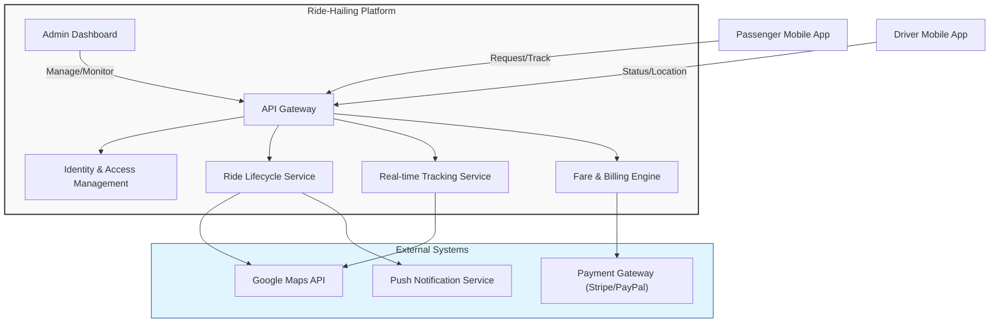
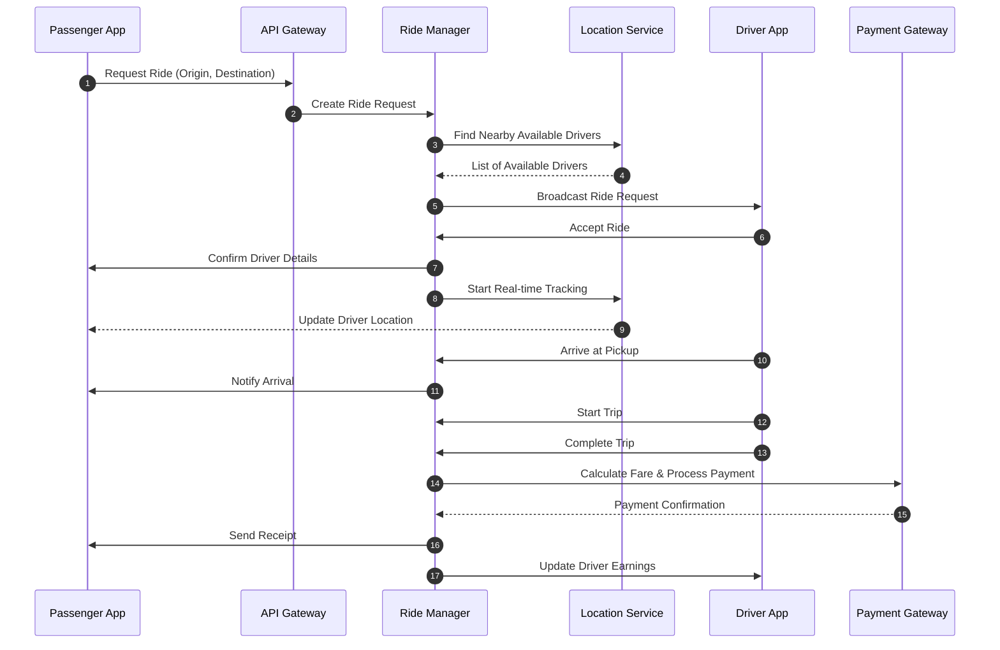
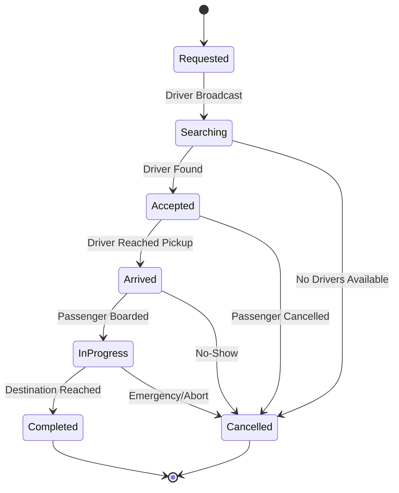
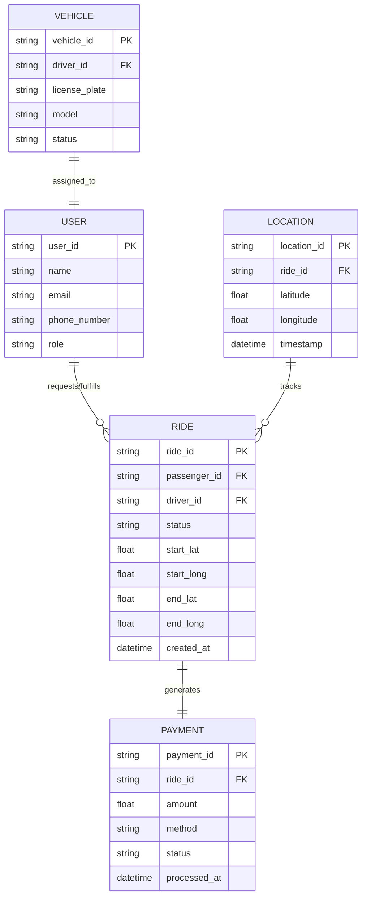

# Software Requirements Specification for Ride-Hailing Application Platform

**Standard:** IEEE 830-1998 Aligned SRS Document  
**Generated On:** 2026-09-19 02:08:08 UTC  
**Target Audience:** Software Engineers, QA Engineers, System Architects, and Project Stakeholders  
**System Vision:** A mobile-based ride-hailing platform facilitating real-time ride requests between passengers and drivers, including GPS tracking, automated fare calculation, multi-method payment processing, administrative oversight, and ride lifecycle management including cancellations and no-shows.

---

## Table of Contents
- [Introduction](#introduction)
- [Overall Description](#overall-description)
- [System Features & Functional Requirements](#system-features--functional-requirements)
- [External Interface Requirements](#external-interface-requirements)
- [Non-Functional & Quality Attributes](#non-functional--quality-attributes)
- [Document Traceability & Diagram Manifest](#document-traceability--diagram-manifest)

---

## Introduction

## 1.0 Introduction

### 1.1 Purpose
The purpose of this Software Requirements Specification (SRS) is to define the functional and non-functional requirements for the Ride-Hailing Application Platform. This document serves as the primary reference for stakeholders, developers, and quality assurance teams to ensure the delivery of a robust, scalable, and secure mobile-based platform that facilitates real-time ride requests, automated fare calculation, and lifecycle management of ride services.

### 1.2 Scope
The Ride-Hailing Application Platform is a mobile-centric ecosystem designed to connect passengers with drivers. The scope of this system includes:
*   **Real-time Ride Lifecycle Management:** From initial request and atomic driver assignment to trip completion, including handling of cancellations and no-shows (see [FR-001], [FR-007]).
*   **Geolocation Services:** Integration with third-party Maps/GPS services for real-time tracking and routing (see [FR-002]).
*   **Financial Transactions:** Automated fare calculation based on demand-based pricing and multi-method payment processing via external gateways (see [FR-003], [FR-004]).
*   **Administrative Oversight:** A management interface for user/driver administration, registration approval, and pricing configuration (see [FR-006]).
*   **Security:** OTP-based authentication and role-based access control (see [FR-005]).

The system is intended for deployment on iOS and Android mobile platforms.

### 1.3 Intended Audience
This document is intended for:
*   **Project Stakeholders:** To understand the business value and functional boundaries of the platform.
*   **Software Architects & Developers:** To guide the implementation of system features, API integrations, and atomic state management.
*   **Quality Assurance Engineers:** To develop test plans and acceptance criteria based on the defined requirements.
*   **System Administrators:** To understand the operational capabilities and configuration parameters of the platform.

### 1.4 Document Conventions
This document adheres to the IEEE 830 standard for Software Requirements Specifications. To ensure clarity and consistency, the following conventions are used:

*   **RFC 2119 Keywords:**
    *   **MUST:** Indicates an absolute requirement that is mandatory for the system.
    *   **SHOULD:** Indicates a recommended feature or behavior that is highly desirable but not strictly mandatory.
    *   **MAY:** Indicates an optional feature or behavior.
*   **Requirement Identification:** Each requirement is uniquely identified using the format `[FR-XXX]` for functional requirements and `[NFR-XXX]` for non-functional requirements.
*   **Cross-Referencing:** References to other sections of this document are explicitly noted (e.g., "See Section 4.0 for API specifications").

### 1.5 Definitions, Acronyms, and Abbreviations
| Term | Definition |
| :--- | :--- |
| **OTP** | One-Time Password, used for secure authentication. |
| **PCI-DSS** | Payment Card Industry Data Security Standard. |
| **ETA** | Estimated Time of Arrival. |
| **Atomic Operation** | An operation that completes entirely or not at all, ensuring data integrity during concurrent ride requests. |
| **Exponential Backoff** | A strategy for handling service retries by increasing wait times between attempts. |

### 1.6 References
*   IEEE Std 830-1998, *IEEE Recommended Practice for Software Requirements Specifications*.
*   RFC 2119, *Key words for use in RFCs to Indicate Requirement Levels*.
*   Project Architecture Documentation (See Section 4.0 for External Interface Requirements).

---

## Overall Description

## 2.0 Overall Description

### 2.1 Product Perspective
The Ride-Hailing Application Platform is a mobile-first ecosystem designed to facilitate real-time, on-demand transportation services. The system acts as a centralized broker between passengers and drivers, managing the entire lifecycle of a ride—from initial request and driver matching to fare calculation and payment settlement. 

The platform is designed as a distributed system, requiring high-availability synchronization between mobile clients (iOS/Android) and the backend infrastructure. It is architected to handle concurrent requests through atomic state management, ensuring that ride assignments and status transitions remain consistent even under high load.

### 2.2 Product Functions
The system provides the following core functional capabilities:
*   **Ride Lifecycle Management:** Facilitates ride requests, atomic driver assignment, and handling of cancellations and no-shows (see [FR-001], [FR-007]).
*   **Real-time Geolocation:** Provides continuous tracking and ETA updates via integration with external mapping services (see [FR-002]).
*   **Dynamic Pricing:** Calculates fares based on distance, time, and configurable demand-based multipliers (see [FR-003]).
*   **Secure Transactions:** Processes payments through integrated third-party gateways (see [FR-004]).
*   **Identity & Access Management:** Manages user roles and secure access via OTP-based authentication (see [FR-005]).
*   **Administrative Oversight:** Provides tools for user management, driver verification, and system configuration (see [FR-006]).

### 2.3 User Classes and Characteristics
| Actor | Description |
| :--- | :--- |
| **Passenger** | End-user who requests rides, tracks vehicle location, processes payments, and manages ride history. |
| **Driver** | Service provider who manages vehicle availability, accepts/rejects ride requests, and reports no-shows. |
| **Administrator** | Platform operator responsible for user/driver management, registration approvals, and pricing configuration. |

### 2.4 Operating Environment
*   **Client Platforms:** Native mobile applications for iOS and Android.
*   **Authentication:** Mandatory OTP-based verification for all user sessions.
*   **Connectivity:** The system assumes reliable internet connectivity for real-time data exchange.
*   **External Systems:**
    *   **Payment Gateway:** External service for credit card and digital wallet processing.
    *   **Maps/GPS Service:** External provider for geolocation, routing, and distance calculation.
    *   **SMS Gateway:** External provider for OTP delivery.

### 2.5 Design and Implementation Constraints
*   **Atomic State Updates:** All ride state transitions (e.g., assignment, cancellation) must be atomic to prevent race conditions and ensure data integrity.
*   **Resilience:** The system must implement bounded exponential backoff for all retries involving external service calls to prevent cascading failures during outages.
*   **Compliance:** All payment processing must adhere to PCI-DSS standards (see [NFR-002]).
*   **Performance:** The system must maintain p99 latency of < 500ms for GPS location updates (see [NFR-001]).

### 2.6 Assumptions and Dependencies
1.  **Connectivity:** It is assumed that both passenger and driver devices maintain sufficient network connectivity to transmit location data and receive ride updates.
2.  **Third-Party Availability:** The system is dependent on the continuous availability of the integrated Payment Gateways, Maps/GPS services, and SMS providers.
3.  **Service Degradation:** In the event of a Maps/GPS service outage, the system will rely on cached location data and stored timestamps to reconcile ride state and fare calculations once connectivity is restored (see [FR-002]).

### Architectural Model: System Context Architecture

---

## System Features & Functional Requirements

## [3.0] System Features & Functional Requirements

This section details the functional requirements for the Ride-Hailing Application Platform, categorized by logical system workflows. These requirements are designed to ensure atomic state transitions, secure financial processing, and robust administrative oversight.

### 3.1 Ride Lifecycle Management
This workflow encompasses the end-to-end process of requesting, tracking, and terminating a ride.

*   **[FR-001] Ride Request Management**
    *   **Description:** Passengers must be able to request a ride from a specific origin to a destination. The system must ensure atomic assignment of a ride to only one driver, rejecting simultaneous attempts.
    *   **Priority:** Must Have
    *   **Acceptance Criteria:**
        *   System displays available drivers in the vicinity.
        *   Passenger receives confirmation once a driver accepts the request.
        *   System uses atomic operations to prevent multiple drivers from accepting the same ride request.
        *   Drivers attempting to accept an already-assigned ride receive a rejection notification.

*   **[FR-002] Real-time GPS Tracking**
    *   **Description:** The system must track and display the driver's location to the passenger in real-time, with robust handling for service outages. (See Section 4.0 for Maps/GPS API integration).
    *   **Priority:** Must Have
    *   **Acceptance Criteria:**
        *   Passenger map updates driver position at least every 5 seconds.
        *   Estimated Time of Arrival (ETA) is displayed and updated dynamically.
        *   During Maps/GPS service outages, the system preserves ride state and displays the last known location.
        *   System implements bounded exponential backoff for service retries.
        *   System notifies users when live location data is temporarily unavailable.
        *   System reconciles fare data post-outage using stored timestamps and location logs.

*   **[FR-007] Ride Cancellation and No-Show Management**
    *   **Description:** The system must handle ride cancellations and no-shows, applying fees and tracking behavior based on defined time thresholds.
    *   **Priority:** Must Have
    *   **Acceptance Criteria:**
        *   Passengers can cancel rides; no fee if cancelled within 2 minutes of driver acceptance.
        *   Cancellation fees apply if cancelled after the 2-minute grace period.
        *   Drivers can mark passengers as no-shows after a 5-minute waiting period at the pickup location.
        *   System records all cancellation/no-show events in user/driver history.
        *   System tracks repeated unjustified cancellations to influence account status.

### 3.2 Financials
This workflow covers the automated calculation of fares and the secure processing of payments.

*   **[FR-003] Automated Fare Calculation**
    *   **Description:** The system must calculate the fare based on distance, time, and configurable demand-based multipliers.
    *   **Priority:** Must Have
    *   **Acceptance Criteria:**
        *   Fare is calculated immediately upon trip completion.
        *   Fare breakdown is visible to the passenger.
        *   Passenger sees estimated fare and surge multiplier before confirming the ride.
        *   Administrators can configure demand thresholds, supply thresholds, maximum surge multipliers, and geographic zones.

*   **[FR-004] Payment Processing**
    *   **Description:** The system must support multiple payment methods for trip settlement via external Payment Gateways.
    *   **Priority:** Must Have
    *   **Acceptance Criteria:**
        *   System successfully integrates with at least two payment providers.
        *   Receipt is generated and sent to the passenger upon successful payment.

### 3.3 User Management
This workflow governs identity verification and role-based access control.

*   **[FR-005] Authentication and Authorization**
    *   **Description:** Users must register and log in using mobile phone numbers with OTP verification, with role-based access control.
    *   **Priority:** Must Have
    *   **Acceptance Criteria:**
        *   OTP verification is required for all login attempts.
        *   Passengers and drivers have distinct permission sets based on their roles.
        *   Drivers must complete a verification process before accepting rides.

### 3.4 Admin Oversight
This workflow provides administrative control over the platform ecosystem.

*   **[FR-006] Administrative Oversight**
    *   **Description:** Administrators must have access to platform management tools to maintain system integrity.
    *   **Priority:** Must Have
    *   **Acceptance Criteria:**
        *   Administrators can view and manage user and driver accounts.
        *   Administrators can review and approve driver registration applications.
        *   Administrators can configure demand-based pricing parameters.

### Architectural Model: Ride Request and Fulfillment Workflow

### Architectural Model: Ride Lifecycle State Machine

---

## External Interface Requirements

## [4.0] External Interface Requirements

This section defines the requirements for the interfaces between the Ride-Hailing Application Platform and external systems, including user-facing mobile interfaces, mapping services, and financial gateways.

### 4.1 User Interfaces (UI/UX)
The application shall support native mobile interfaces for both iOS and Android platforms. The UI design must prioritize accessibility, rapid interaction, and real-time feedback to support the ride lifecycle defined in [FR-001] through [FR-007].

*   **Passenger Interface:**
    *   **Dashboard:** Must provide a map-centric view for origin/destination selection and real-time tracking of the assigned vehicle.
    *   **Ride Status:** Must display dynamic ETA updates and driver identification details.
    *   **Payment:** Must provide a secure interface for selecting payment methods and viewing fare breakdowns as per [FR-003] and [FR-004].
*   **Driver Interface:**
    *   **Availability Toggle:** A clear control for drivers to set their status (Online/Offline).
    *   **Ride Management:** A high-visibility interface for accepting/rejecting ride requests and marking no-shows after the 5-minute threshold [FR-007].
*   **Administrative Interface:**
    *   **Management Console:** A web-based dashboard for user/driver account management and configuration of demand-based pricing parameters [FR-006].

### 4.2 Maps/GPS Service Integration
The system relies on third-party mapping services for geolocation, routing, and distance calculations.

*   **Protocol:** RESTful API over HTTPS (TLS 1.2+).
*   **Data Exchange:** JSON format for coordinate transmission and route geometry.
*   **Operational Requirements:**
    *   **Latency:** Must support the performance requirement of p99 latency < 500ms for location updates.
    *   **Resilience:** The system must implement bounded exponential backoff for all API retries during service degradation or outages.
    *   **State Preservation:** In the event of a service outage, the system must cache the last known location and reconcile fare data post-outage using stored timestamps and location logs [FR-002].

### 4.3 Payment Gateway Integration
To ensure secure financial transactions, the platform integrates with third-party payment providers.

*   **Compliance:** All payment processing must strictly adhere to **PCI-DSS** standards. No raw credit card data shall be stored on the application servers.
*   **Transaction Flow:**
    1.  **Tokenization:** The mobile client interacts directly with the Payment Gateway SDK to tokenize payment information.
    2.  **Authorization:** The backend sends the tokenized request to the gateway to authorize the fare calculated in [FR-003].
    3.  **Settlement:** Upon trip completion, the system triggers the capture of funds.
    4.  **Confirmation:** The gateway returns a transaction ID, which is logged in the system to generate the passenger receipt [FR-004].
*   **Error Handling:** The system must handle gateway timeouts and declines gracefully, notifying the user of the failure and providing alternative payment options.

### 4.4 Communication Interfaces
*   **SMS Gateway:** Used for OTP-based authentication [FR-005]. The system must interface with an SMS provider to deliver verification codes within a 30-second window.
*   **Push Notifications:** The system shall utilize platform-specific notification services (APNs for iOS, FCM for Android) to alert users of ride status changes, driver arrival, and cancellation updates.

### Architectural Model: Core Domain Data Model

---

## Non-Functional & Quality Attributes

## [5.0] Non-Functional & Quality Attributes

This section defines the quality attributes and non-functional requirements necessary to ensure the Ride-Hailing Application Platform meets its operational, security, and reliability objectives.

### 5.1 Performance Requirements
The system must maintain high responsiveness to ensure a seamless user experience, particularly for real-time geolocation tracking and ride matching.

| Metric ID | Attribute | Requirement | Target |
| :--- | :--- | :--- | :--- |
| [NFR-PER-001] | GPS Latency | p99 latency for location updates between driver and passenger. | < 500ms |
| [NFR-PER-002] | API Response | Average response time for core ride lifecycle operations (e.g., [FR-001]). | < 200ms |
| [NFR-PER-003] | Concurrency | System must support atomic ride assignment under high load. | Zero race conditions |

### 5.2 Security Requirements
Given the handling of financial transactions and personal user data, the system must adhere to strict security protocols.

*   **[NFR-SEC-001] Payment Security:** All payment processing must maintain 100% compliance with PCI-DSS standards. The system shall not store raw credit card information; all transactions must be tokenized via the external Payment Gateway (see Section 4.0).
*   **[NFR-SEC-002] Authentication:** All user sessions must be secured via OTP-based authentication as defined in [FR-005]. OTPs must have a maximum validity period of 180 seconds and be rate-limited to prevent brute-force attacks.
*   **[NFR-SEC-003] Data Protection:** All data in transit must be encrypted using TLS 1.2 or higher. Sensitive user data at rest must be encrypted using AES-256.
*   **[NFR-SEC-004] Role-Based Access Control (RBAC):** The system must enforce strict authorization boundaries between Passengers, Drivers, and Administrators to prevent unauthorized access to administrative oversight tools [FR-006].

### 5.3 Reliability and Availability
The platform is designed for high availability to ensure continuous service for both drivers and passengers.

*   **[NFR-REL-001] Uptime Target:** The system shall maintain a minimum of 99.9% uptime, excluding scheduled maintenance windows.
*   **[NFR-REL-002] Graceful Degradation:** In the event of a partial service outage (e.g., Maps/GPS service failure), the system must:
    *   Preserve the current ride state [FR-002].
    *   Display the last known location to the passenger.
    *   Notify users of the degraded state via the mobile interface.
    *   Reconcile fare data post-outage using stored timestamps and location logs once connectivity is restored.
*   **[NFR-REL-003] Resiliency:** The system must implement bounded exponential backoff for all retries involving external dependencies (Maps/GPS Service, Payment Gateway) to prevent cascading failures.

### 5.4 Maintainability and Scalability
*   **[NFR-MS-001] Modularity:** The system architecture must decouple the ride-matching engine from the payment and notification services to allow independent scaling.
*   **[NFR-MS-002] Observability:** The system must log all critical state transitions (ride requests, cancellations, payments) to facilitate audit trails and administrative troubleshooting [FR-006].

---

## Document Traceability & Diagram Manifest

| Diagram ID | Diagram Title | Syntax | Status | Target Section |
|---|---|---|---|---|
| `diag-001` | System Context Architecture | `mermaid` | ✅ Validated | Section 2.0 |
| `diag-002` | Ride Request and Fulfillment Workflow | `mermaid` | ✅ Validated | Section 3.0 |
| `diag-003` | Ride Lifecycle State Machine | `mermaid` | ✅ Validated | Section 3.0 |
| `diag-004` | Core Domain Data Model | `mermaid` | ✅ Validated | Section 4.0 |