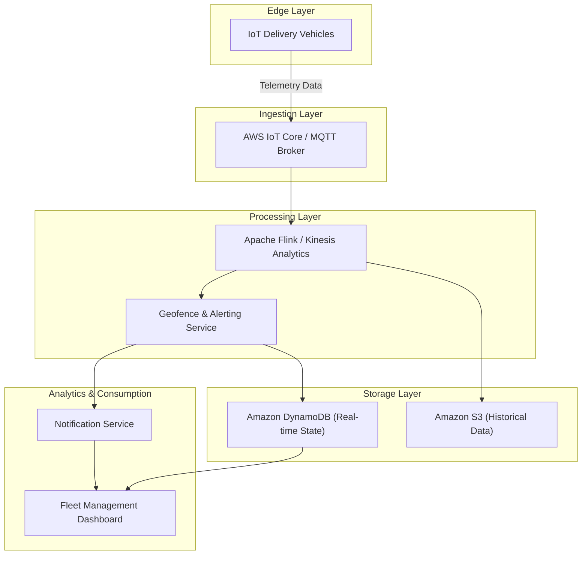
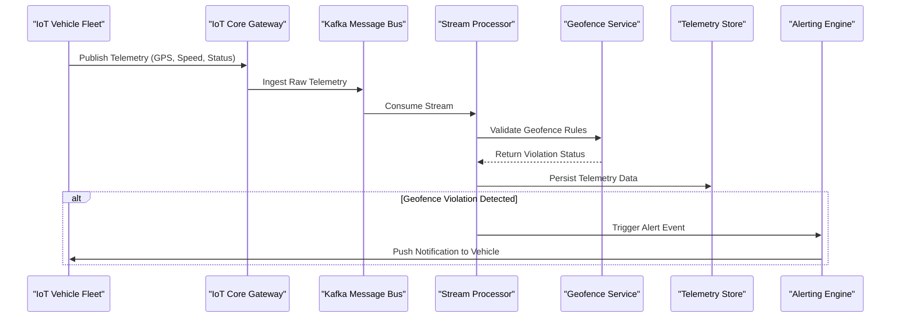
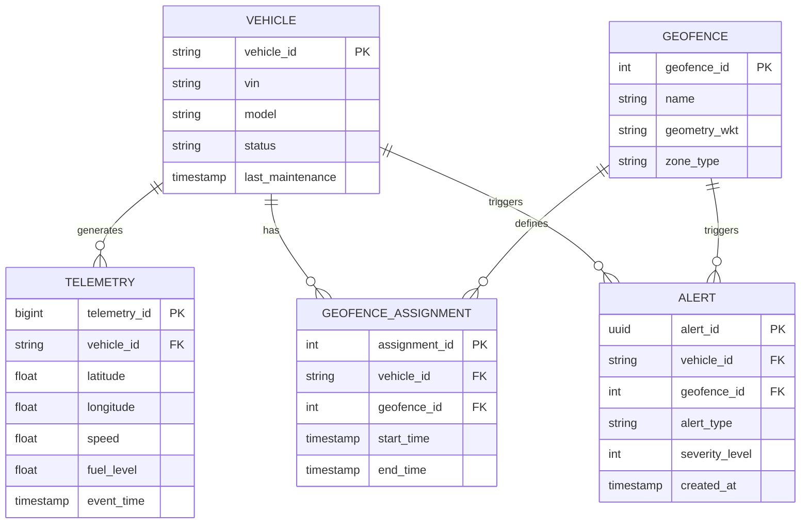
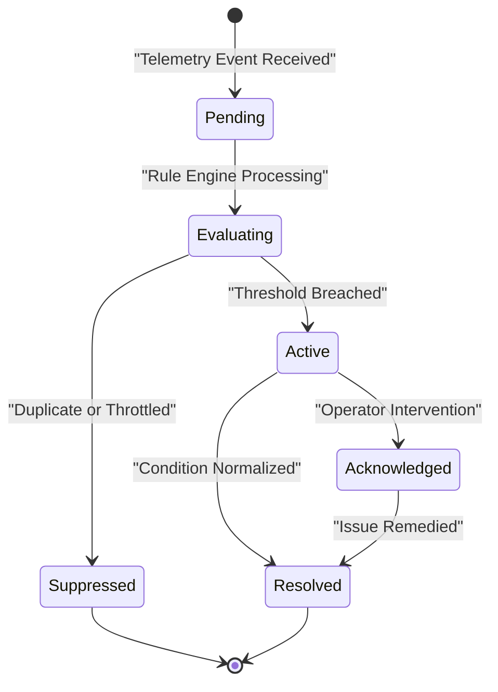

# Software Requirements Specification: IoT Vehicle Fleet Telemetry Ingestion Platform

**Standard:** IEEE 830-1998 Aligned SRS Document  
**Generated On:** 2026-09-13 03:50:16 UTC  
**Target Audience:** Software Engineers, System Architects, DevOps Engineers, and QA Analysts  
**System Vision:** A cloud-native platform designed to ingest, process, and analyze real-time telemetry data from 50,000 delivery vehicles, providing geofence monitoring, alerting, and fleet management analytics.

---

## Table of Contents
- [Introduction](#introduction)
- [Overall Description](#overall-description)
- [System Features & Functional Requirements](#system-features--functional-requirements)
- [External Interface Requirements](#external-interface-requirements)
- [Non-Functional & Quality Attributes](#non-functional--quality-attributes)
- [Document Traceability & Diagram Manifest](#document-traceability--diagram-manifest)

---

## Introduction

## 1.0 Introduction

### 1.1 Purpose
The purpose of this document is to define the software requirements for the **IoT Vehicle Fleet Telemetry Ingestion Platform**. This platform is a cloud-native system engineered to ingest, process, and analyze real-time telemetry data from a fleet of 50,000 delivery vehicles. The system provides critical capabilities, including real-time geofence monitoring, automated alerting, and comprehensive fleet management analytics. This document serves as the primary reference for technical stakeholders, including architects, developers, and DevOps engineers, to guide the implementation and deployment of the platform on AWS EKS.

### 1.2 Scope
The scope of this project encompasses the end-to-end lifecycle of vehicle telemetry data:
*   **Ingestion:** Secure, high-throughput ingestion of GPS and OBD-II diagnostic data via MQTT and EMQX.
*   **Processing:** Real-time stream processing using Apache Kafka and spatial analysis via PostGIS.
*   **Alerting:** Immediate notification delivery for geofence violations via WebSockets and FCM.
*   **Analytics & Storage:** Long-term data management utilizing TimescaleDB for hot storage and S3 for cold storage archiving.

This document covers the functional requirements (see Section 3.0) and non-functional quality attributes (see Section 5.0) necessary to support 50,000 concurrent vehicle connections. It does not cover the physical manufacturing or firmware development of the IoT hardware devices themselves, though it defines the interface requirements for these devices (see Section 4.0).

### 1.3 Definitions, Acronyms, and Abbreviations
| Term | Definition |
| :--- | :--- |
| **FCM** | Firebase Cloud Messaging |
| **MQTT** | Message Queuing Telemetry Transport |
| **OBD-II** | On-Board Diagnostics II |
| **RBAC** | Role-Based Access Control |
| **EKS** | Amazon Elastic Kubernetes Service |
| **p95** | 95th percentile latency metric |

### 1.4 Target Audience
This specification is intended for the following technical stakeholders:
*   **System Architects:** To ensure the cloud-native design aligns with the specified throughput and latency constraints.
*   **Software Engineers:** To implement the ingestion pipelines, spatial analysis logic, and RBAC-protected APIs.
*   **DevOps Engineers:** To manage the infrastructure-as-code (Terraform) deployment on AWS EKS.
*   **Product Owners:** To validate that the system features meet the operational needs of Fleet Managers, Dispatchers, and Drivers.

### 1.5 References
*   [2.0] Overall Description: System context and user roles.
*   [3.0] System Features & Functional Requirements: Detailed breakdown of `[FR-001]` through `[FR-005]`.
*   [4.0] External Interface Requirements: API and hardware communication protocols.
*   [5.0] Non-Functional & Quality Attributes: Performance, scalability, and security benchmarks.

---

## Overall Description

## 2.0 Overall Description

### 2.1 Product Perspective
The IoT Vehicle Fleet Telemetry Ingestion Platform is a high-throughput, cloud-native system designed to provide real-time visibility and management for a fleet of 50,000 delivery vehicles. The system acts as the central nervous system for fleet operations, bridging the gap between edge-based IoT hardware and centralized management dashboards.

The platform is architected to ingest high-velocity telemetry data, perform real-time spatial analysis, and trigger automated alerts. It operates as a distributed system within the AWS ecosystem, utilizing managed services and containerized microservices to ensure scalability and reliability. The system integrates with external hardware (telemetry devices) and third-party notification services (FCM) to complete the operational loop.

### 2.2 User Classes and Characteristics
The system employs Role-Based Access Control (RBAC) to manage user interactions, ensuring data security and operational focus:

| User Class | Responsibilities | Access Level |
| :--- | :--- | :--- |
| **Fleet Manager** | Full administrative control, geofence configuration, and diagnostic oversight. | Full Access |
| **Dispatcher** | Real-time monitoring of vehicle status and active alert management. | Read-Only (Fleet-wide) |
| **Driver** | Monitoring of assigned vehicle status and diagnostic health. | Read-Only (Assigned Vehicle) |

### 2.3 External Actors
*   **Vehicle Telemetry Device:** IoT hardware installed in delivery vans. These devices transmit GPS coordinates and OBD-II diagnostic data via MQTT.
*   **Alerting System:** An external notification infrastructure, specifically Firebase Cloud Messaging (FCM), responsible for delivering push notifications to mobile or web clients upon geofence violation events.

### 2.4 Operating Environment and Constraints
The platform is subject to the following cloud-native and technical constraints:

*   **Infrastructure:** The system must be deployed on **AWS EKS** using **Terraform** for Infrastructure as Code (IaC) to ensure environment reproducibility.
*   **Data Ingestion:** Must utilize **MQTT** via the **EMQX** broker, bridging to **Apache Kafka** for high-throughput message streaming.
*   **Storage:** 
    *   **TimescaleDB** is required for time-series GPS metrics.
    *   **PostgreSQL with PostGIS** is required for spatial geofencing and fleet/driver metadata.
*   **Security:** All API endpoints must be secured using **OAuth2** with **JWT** tokens.
*   **Scalability:** The architecture must support 50,000 concurrent active vehicle connections as defined in [NFR-001].

### 2.5 Assumptions and Dependencies
*   **Connectivity:** It is assumed that vehicle telemetry devices maintain reliable cellular or satellite connectivity to transmit data to the ingestion layer.
*   **Service Availability:** The system assumes the availability of the **Firebase Cloud Messaging (FCM)** service for the delivery of push notifications. Failure of this external service will impact the delivery of alerts as defined in [FR-003].
*   **Configuration:** It is assumed that all geofence boundaries are accurately defined and provided by the Fleet Manager via the dashboard interface before violation detection can occur.

### 2.6 Summary of Requirements Traceability
This section provides the context for the functional and non-functional requirements detailed in subsequent sections:
*   **Ingestion:** See [FR-001] for telemetry processing specifications.
*   **Spatial Analysis:** See [FR-002] for geofence detection logic.
*   **Alerting:** See [FR-003] for notification workflows.
*   **Data Lifecycle:** See [FR-005] for storage and retention policies.

### Architectural Model: IoT Fleet Telemetry System Context

---

## System Features & Functional Requirements

## [3.0] System Features & Functional Requirements

This section defines the core functional requirements for the IoT Vehicle Fleet Telemetry Ingestion Platform. These requirements are designed to support the high-throughput ingestion, spatial processing, and real-time alerting necessary for a fleet of 50,000 vehicles.

### 3.1 Functional Requirements Summary

| ID | Title | Priority | Primary Actor |
| :--- | :--- | :--- | :--- |
| **[FR-001]** | Telemetry Data Ingestion | Must Have | Vehicle Telemetry Device |
| **[FR-002]** | Geofence Violation Detection | Must Have | System (Automated) |
| **[FR-003]** | Real-time Alerting | Must Have | Alerting System |
| **[FR-004]** | Fleet Analytics Dashboard | Should Have | Fleet Manager, Dispatcher, Driver |
| **[FR-005]** | Data Lifecycle Management | Must Have | System (Automated) |

---

### 3.2 Detailed Functional Requirements

#### [FR-001] Telemetry Data Ingestion
*   **Description:** The system shall ingest real-time GPS and OBD-II diagnostic data from 50,000 concurrent vehicle connections using the MQTT protocol via an EMQX broker, bridging data to Apache Kafka for downstream processing.
*   **Acceptance Criteria:**
    *   System successfully processes data streams from 50,000 devices simultaneously.
    *   Data integrity is maintained during the transition from MQTT to Kafka.
    *   Ingestion latency is under 500ms at p95 (See Section 5.0 for performance metrics).

#### [FR-002] Geofence Violation Detection
*   **Description:** The system shall evaluate incoming GPS coordinates against predefined polygonal geofence boundaries using the PostGIS extension within PostgreSQL.
*   **Acceptance Criteria:**
    *   Violation detected within 5 seconds of coordinate receipt.
    *   System correctly identifies entry/exit events using PostGIS spatial queries.

#### [FR-003] Real-time Alerting
*   **Description:** The system shall trigger alerts immediately upon detection of a geofence violation via WebSockets to the dashboard and push notifications via Firebase Cloud Messaging (FCM).
*   **Acceptance Criteria:**
    *   Alert notification sent to the dashboard via WebSockets within 2 seconds of detection.
    *   Push notification sent via FCM within 2 seconds of detection.

#### [FR-004] Fleet Analytics Dashboard
*   **Description:** The system shall provide a web-based dashboard for users to view vehicle status and historical analytics, governed by Role-Based Access Control (RBAC).
*   **Acceptance Criteria:**
    *   Dashboard displays real-time location of all vehicles.
    *   Dashboard provides historical diagnostic reports.
    *   RBAC enforces access levels: Fleet Managers (Full Access), Dispatchers (Read-only), and Drivers (Assigned vehicle only). See Section 4.0 for API security specifications.

#### [FR-005] Data Lifecycle Management
*   **Description:** The system shall manage telemetry data retention by keeping 90 days of data in hot storage (TimescaleDB) and archiving data older than 90 days to S3 cold storage for up to 1 year.
*   **Acceptance Criteria:**
    *   Data older than 90 days is automatically moved to S3.
    *   System maintains performance levels despite data volume growth.
    *   Archived data is retrievable for audit purposes.

### Architectural Model: Telemetry Ingestion and Geofence Processing Workflow

### Architectural Model: Telemetry Data Entity Relationship Model

### Architectural Model: Alert Lifecycle State Machine

---

## External Interface Requirements

## [4.0] External Interface Requirements

This section defines the interfaces between the IoT Vehicle Fleet Telemetry Ingestion Platform and external entities, including hardware devices, end-user applications, and third-party services.

### 4.1 User Interfaces
The platform provides a web-based dashboard to support the roles of Fleet Manager, Dispatcher, and Driver (see [FR-004]). 
*   **Dashboard Interface:** A responsive web application utilizing WebSockets for real-time data streaming and RESTful APIs for historical reporting and administrative tasks.
*   **Access Control:** All user interfaces are protected by OAuth2/JWT authentication, with UI components dynamically rendered based on the user's RBAC profile.

### 4.2 Hardware Interfaces
The primary hardware interface consists of the IoT telemetry devices installed in delivery vehicles.
*   **Protocol:** MQTT (Message Queuing Telemetry Transport) v3.1.1 or v5.0.
*   **Data Payload:** JSON-formatted telemetry packets containing GPS coordinates (latitude, longitude, altitude), timestamp, and OBD-II diagnostic codes.
*   **Connectivity:** Devices maintain a persistent connection to the EMQX broker cluster.
*   **Requirement Traceability:** This interface supports the ingestion requirements defined in [FR-001].

### 4.3 Software Interfaces
The platform integrates with several external software systems to facilitate data ingestion, processing, and notification.

| Interface | Type | Purpose |
| :--- | :--- | :--- |
| **EMQX Broker** | Message Broker | Ingestion of MQTT telemetry streams from 50,000 concurrent devices. |
| **Apache Kafka** | Message Bus | High-throughput streaming of telemetry data from EMQX to downstream consumers. |
| **FCM (Firebase Cloud Messaging)** | Notification Service | Delivery of push notifications for geofence violations and critical alerts ([FR-003]). |
| **PostgreSQL/PostGIS** | Database | Spatial analysis for geofence boundary evaluation ([FR-002]). |
| **TimescaleDB** | Database | Time-series storage for GPS and diagnostic metrics ([FR-005]). |

### 4.4 Communication Interfaces
The platform utilizes the following communication standards to ensure interoperability and security:

#### 4.4.1 MQTT (Device-to-Cloud)
*   **Usage:** Used for telemetry ingestion from vehicle devices to the EMQX broker.
*   **Security:** TLS 1.2/1.3 encryption is mandatory for all device-to-broker communication.

#### 4.4.2 WebSockets (Cloud-to-Dashboard)
*   **Usage:** Used for real-time updates of vehicle locations and geofence violation alerts ([FR-003]).
*   **Security:** Connections must be established over `wss://` (Secure WebSockets) with an authenticated JWT token passed in the initial handshake.

#### 4.4.3 REST API (Client-to-Cloud)
*   **Usage:** Used for fleet management, historical analytics, and geofence configuration ([FR-004]).
*   **Security:** All endpoints are protected by OAuth2/JWT. Access is strictly governed by RBAC as defined in the system security constraints.
*   **Specification:** See Section 3.0 for functional requirements regarding API-driven data management.

### 4.5 External Service Dependencies
*   **FCM Availability:** The system assumes the availability of the Firebase Cloud Messaging service for the delivery of push notifications. Failure of this service will result in a degradation of the alerting capability defined in [FR-003].
*   **Cloud Infrastructure:** The platform is designed for deployment on AWS EKS. All external interfaces must be configured to operate within the VPC and security group constraints defined in the infrastructure-as-code (Terraform) repository.

---

## Non-Functional & Quality Attributes

## [5.0] Non-Functional & Quality Attributes

This section defines the quality attributes and non-functional requirements necessary to ensure the IoT Vehicle Fleet Telemetry Ingestion Platform meets its operational objectives. These requirements are critical for supporting the scale and reliability demands of a 50,000-vehicle fleet.

### 5.1 Performance Requirements
The system must maintain high throughput and low latency to ensure real-time visibility and safety. Performance is measured from the point of data transmission by the `Vehicle Telemetry Device` to the final delivery of the alert.

| Requirement ID | Metric | Target Threshold |
| :--- | :--- | :--- |
| [NFR-PERF-001] | Ingestion Latency (p95) | < 500ms |
| [NFR-PERF-002] | Total Alert Latency | < 7 seconds |

*   **[NFR-PERF-001] Ingestion Latency:** The system shall process incoming MQTT telemetry packets via the EMQX broker and Kafka pipeline such that the p95 latency is under 500ms. This supports the functional requirement [FR-001].
*   **[NFR-PERF-002] Total Alert Latency:** The end-to-end duration from the `Vehicle Telemetry Device` transmitting a coordinate to the `Alerting System` triggering a notification (via WebSockets or FCM) shall not exceed 7 seconds. This encompasses the processing time defined in [FR-002] and [FR-003].

### 5.2 Scalability
The platform is designed for horizontal scalability to accommodate the growth of the fleet.

*   **[NFR-SCAL-001] Concurrent Connections:** The system must support 50,000 concurrent active `Vehicle Telemetry Device` connections.
*   **[NFR-SCAL-002] Infrastructure Scaling:** As a cloud-native platform deployed on AWS EKS, the system shall utilize Kubernetes Horizontal Pod Autoscalers (HPA) to dynamically adjust compute resources based on CPU and memory utilization to maintain performance metrics under peak load.

### 5.3 Reliability and Availability
To ensure continuous fleet monitoring, the platform must maintain high availability.

*   **[NFR-RELY-001] Uptime:** The system shall maintain 99.9% uptime, excluding scheduled maintenance windows.
*   **[NFR-RELY-002] Data Integrity:** The system shall ensure no data loss during the ingestion pipeline (MQTT to Kafka to TimescaleDB/PostGIS). In the event of a component failure, the system must support message re-queuing and recovery.

### 5.4 Security
Security is enforced across all layers of the platform to protect sensitive vehicle and driver data.

*   **[NFR-SEC-001] Authentication:** All API endpoints and dashboard access points must be protected by OAuth2.0 authentication.
*   **[NFR-SEC-002] Authorization:** The system shall implement Role-Based Access Control (RBAC) using JWT tokens to enforce permissions for `Fleet Manager`, `Dispatcher`, and `Driver` roles as defined in [FR-004].
*   **[NFR-SEC-003] Coverage:** 100% of external-facing API endpoints must require valid JWT validation before processing requests.

### 5.5 Data Lifecycle and Retention
The system must balance performance with long-term storage requirements.

*   **[NFR-DATA-001] Hot Storage:** Telemetry data shall be stored in TimescaleDB for a period of 90 days to ensure high-performance querying for the `Fleet Analytics Dashboard` [FR-005].
*   **[NFR-DATA-002] Cold Storage:** Data exceeding the 90-day retention period shall be automatically offloaded to AWS S3 for long-term archival (up to 1 year) to maintain database performance.

---

## Document Traceability & Diagram Manifest

| Diagram ID | Diagram Title | Syntax | Status | Target Section |
|---|---|---|---|---|
| `diag-001` | IoT Fleet Telemetry System Context | `mermaid` | ✅ Validated | Section 2.0 |
| `diag-002` | Telemetry Ingestion and Geofence Processing Workflow | `mermaid` | ✅ Validated | Section 3.0 |
| `diag-003` | Telemetry Data Entity Relationship Model | `mermaid` | ✅ Validated | Section 3.0 |
| `diag-004` | Alert Lifecycle State Machine | `mermaid` | ✅ Validated | Section 3.0 |