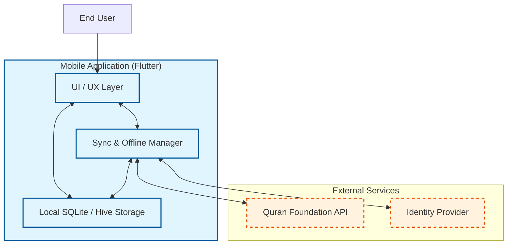
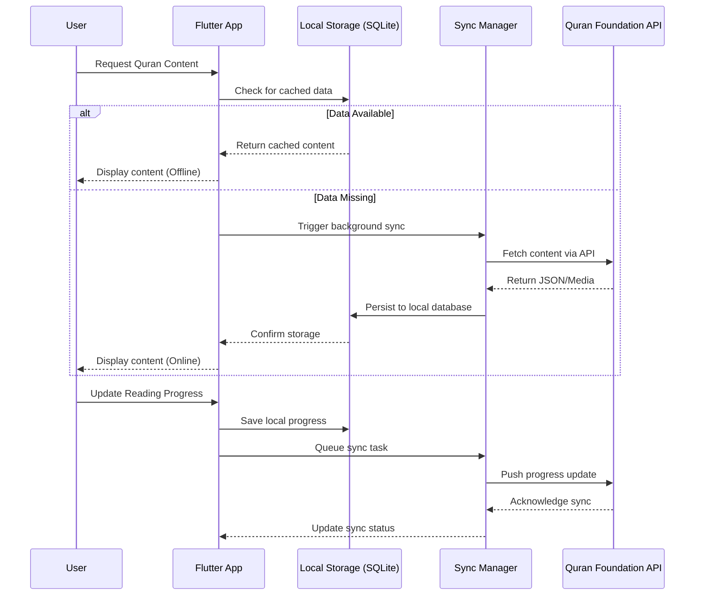
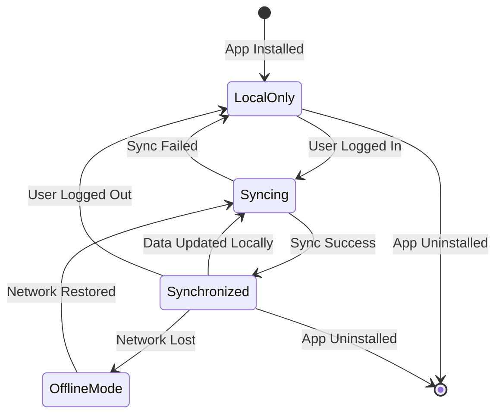
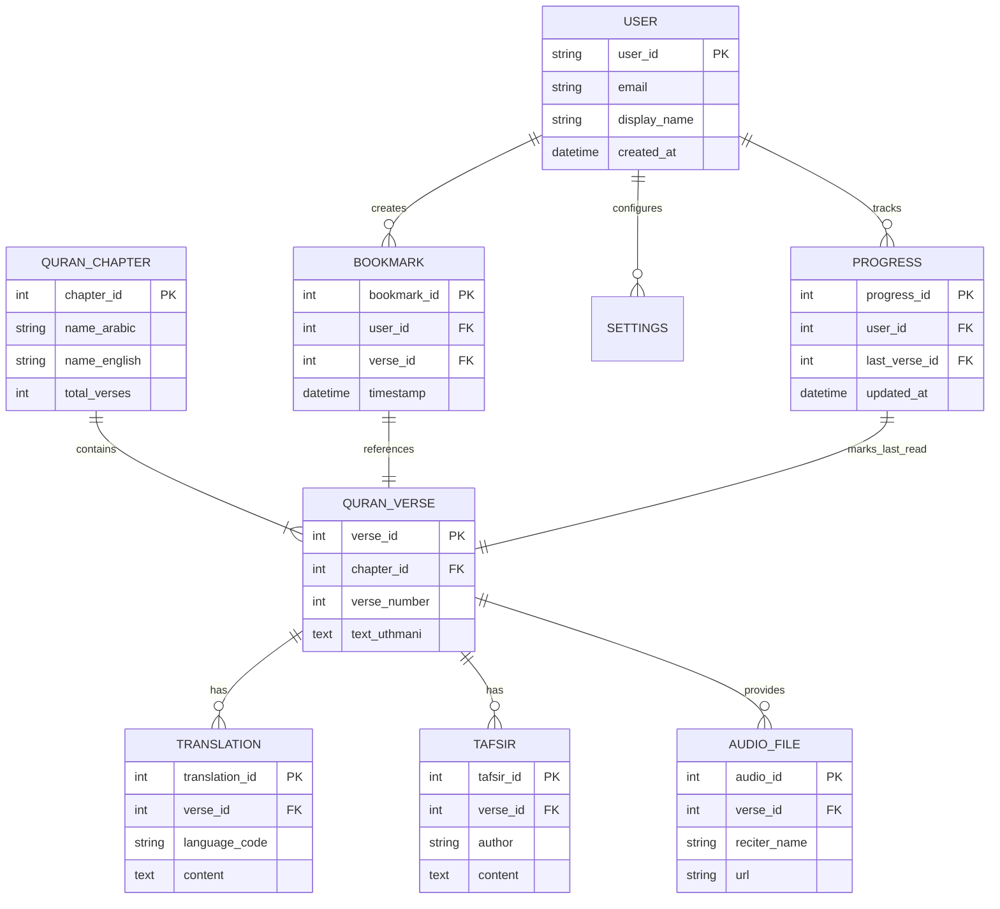

# Software Requirements Specification for Islamic Quran Reading Application

**Standard:** IEEE 830-1998 Aligned SRS Document  
**Generated On:** 2026-09-19 02:00:43 UTC  
**Target Audience:** Software Engineers, Mobile Developers, QA Engineers, and System Architects  
**System Vision:** A mobile application built with Flutter to provide users with a digital interface for reading the Quran, focusing on accessibility, offline-first functionality, and cross-device synchronization via Quran Foundation APIs.

---

## Table of Contents
- [Introduction](#introduction)
- [Overall Description](#overall-description)
- [System Features & Functional Requirements](#system-features--functional-requirements)
- [External Interface Requirements](#external-interface-requirements)
- [Non-Functional & Quality Attributes](#non-functional--quality-attributes)
- [Document Traceability & Diagram Manifest](#document-traceability--diagram-manifest)

---

## Introduction

## 1.0 Introduction

### 1.1 Purpose
The purpose of this Software Requirements Specification (SRS) is to define the functional and non-functional requirements for the Islamic Quran Reading Application. This application is designed as an offline-first mobile tool, providing users with a seamless, high-performance interface for reading, navigating, and studying the Quran. 

This document serves as the primary reference for the development team, stakeholders, and quality assurance engineers to ensure the application meets the core objectives of accessibility, data integrity, and cross-device synchronization via the Quran Foundation APIs.

### 1.2 Scope
The project scope encompasses the development of a cross-platform mobile application built using the **Flutter** framework. Key features include:
*   **Offline-First Architecture:** Utilizing local SQLite (via Drift) to ensure the Quran text and user data (bookmarks, progress) are accessible without an active internet connection.
*   **Content Synchronization:** Integration with Quran Foundation Content Sync APIs for incremental updates.
*   **User Data Management:** Optional account integration using OAuth 2.0 with PKCE to synchronize personal data across devices.
*   **Resilience:** Robust conflict resolution and background synchronization mechanisms to maintain data consistency.

The application is intended for deployment on both iOS and Android platforms. For detailed technical specifications regarding API interactions and data structures, refer to [Section 4.0 External Interface Requirements].

### 1.3 Intended Audience
This document is intended for the following stakeholders:
*   **Software Architects & Developers:** To guide the implementation of the Flutter codebase and local database schema.
*   **Quality Assurance (QA) Engineers:** To develop test plans based on the acceptance criteria defined in [Section 3.0].
*   **Project Managers:** To track progress against the defined functional requirements and constraints.
*   **Quran Foundation Stakeholders:** To ensure alignment with organizational privacy policies and content delivery standards.

### 1.4 Document Conventions
This document adheres to the IEEE 830 standard for Software Requirements Specifications. To ensure clarity and enforce strict adherence to requirements, the following conventions are used:

*   **RFC 2119 Keywords:**
    *   **SHALL:** Indicates a mandatory requirement that must be implemented to satisfy the specification.
    *   **MUST:** Indicates an absolute requirement or constraint that cannot be deviated from.
    *   **SHOULD:** Indicates a recommended practice or feature that is highly desirable but not strictly mandatory for the initial release.
*   **Requirement Identification:** Each requirement is uniquely tagged (e.g., `[FR-001]` for Functional Requirements, `[NFR-001]` for Non-Functional Requirements) to ensure full traceability throughout the development lifecycle.
*   **Cross-Referencing:** References to other sections of this document are explicitly noted (e.g., "See Section 5.0 for Quality Attributes").

### 1.5 Definitions, Acronyms, and Abbreviations
| Term | Definition |
| :--- | :--- |
| **Ayah** | A verse of the Quran. |
| **Drift** | The reactive persistence library used for SQLite in Flutter. |
| **Juz** | A division of the Quran into 30 parts. |
| **OAuth 2.0 / PKCE** | The authentication framework used for secure user login. |
| **Offline-First** | A design pattern where the application prioritizes local data access and queues remote synchronization. |
| **Surah** | A chapter of the Quran. |
| **Sync Token** | A mechanism used to track incremental changes between the client and the Quran Foundation API. |

---

## Overall Description

## 2.0 Overall Description

This section provides an overview of the Islamic Quran Reading Application, defining its role as an offline-first mobile client designed to interface with the Quran Foundation ecosystem.

### 2.1 Product Perspective
The application serves as a standalone, high-performance mobile client for the Quran Foundation. It is designed to operate independently of constant network connectivity, utilizing a local-first architecture to ensure that the Quranic text and user-specific data (bookmarks, reading progress) are always available. 

The system architecture separates concerns between:
*   **Local Storage:** A SQLite database (managed via the Drift library) acting as the primary source of truth for the user experience.
*   **Remote Services:** The Quran Foundation API, which acts as the authoritative source for content updates and the synchronization hub for cross-device user data.

### 2.2 User Classes and Characteristics
| User Class | Description |
| :--- | :--- |
| **Quran Reader** | The primary end-user. This user accesses the application to read, navigate, and study the Quran. They may operate entirely offline or choose to authenticate to enable cross-device synchronization of their personal reading data. |

### 2.3 External Actors
*   **Quran Foundation API:** An external service providing two distinct interfaces:
    *   **Content Sync API:** Delivers incremental updates to Quranic text and metadata.
    *   **User API:** Manages authenticated user profiles, bookmarks, and reading progress synchronization.

### 2.4 Operating Environment
The application is designed for deployment on mobile platforms:
*   **Platforms:** iOS and Android.
*   **Framework:** Flutter (ensuring a unified codebase for cross-platform consistency).
*   **Data Persistence:** Local SQLite database via the Drift ORM.
*   **Security Infrastructure:** Platform-native secure storage (Android Keystore / Apple Keychain) for encryption keys and OAuth tokens.

### 2.5 Design and Implementation Constraints
The development and operation of the application are governed by the following constraints:
*   **Authentication:** Must implement OAuth 2.0 with Proof Key for Code Exchange (PKCE).
*   **Data Security:** All sensitive data (tokens, progress, bookmarks) must be encrypted at rest. Plaintext storage is strictly prohibited.
*   **Privacy Compliance:** Must adhere to the Quran Foundation privacy policy, including the requirement to hard-delete user data within 30 days and associated backups within 90 days (see `[FR-007]`).
*   **Network Security:** All communication with the Quran Foundation API must occur over HTTPS/TLS.
*   **Background Execution:** Must utilize platform-supported background execution for synchronization tasks to minimize battery impact and ensure data consistency.

### 2.6 Assumptions and Dependencies
*   **API Availability:** The application assumes the Quran Foundation APIs are available for periodic synchronization. However, the system is architected to treat API unavailability as a temporary state, maintaining full functionality for the user during outages.
*   **Source of Truth:** The Quran Foundation is the definitive source for all Quranic text. The application assumes that content provided via the Content Sync API is accurate and authoritative.
*   **Offline-First Architecture:** It is assumed that the user will frequently operate in environments with intermittent or no internet connectivity; therefore, all functional requirements (see Section 3.0) are designed to prioritize local data access.
*   **Library Maintenance:** The application relies on third-party security and database libraries, which must be kept up to date to mitigate vulnerabilities.

### 2.7 Summary of Synchronization Strategy
To maintain the offline-first requirement, the application employs an incremental synchronization strategy (see `[FR-008]`). By utilizing sync tokens, the application minimizes data usage and ensures that only necessary changes are transmitted. Conflicts arising from multi-device usage are managed through a combination of deterministic rules and user-driven resolution (see `[FR-005]`), ensuring that no user data is silently discarded.

### Architectural Model: System Context and High-Level Architecture

---

## System Features & Functional Requirements

## [3.0] System Features & Functional Requirements

This section details the functional requirements for the Islamic Quran Reading Application, categorized by logical workflows. These requirements define the system's behavior in accordance with the offline-first architecture and integration with the Quran Foundation APIs.

### 3.1 Content Consumption
These requirements govern the retrieval, storage, and display of Quranic text, ensuring high performance and offline availability.

*   **[FR-001] Quran Text Display**
    *   **Description:** The application shall display the full text of the Quran in Arabic script using a local SQLite database as the primary read source.
    *   **Priority:** Must Have
    *   **Acceptance Criteria:**
        *   Text is rendered correctly using standard Arabic fonts.
        *   Users can scroll through Surahs and Ayahs offline.
        *   Content is synchronized from Quran Foundation using Content Sync.
*   **[FR-002] Navigation System**
    *   **Description:** The application shall provide a navigation mechanism to select specific Surahs or Juz.
    *   **Priority:** Must Have
    *   **Acceptance Criteria:**
        *   User can select a Surah from a list.
        *   User can jump to a specific Ayah.
*   **[FR-008] Incremental Content Synchronization**
    *   **Description:** The application shall perform background-first, incremental synchronization using sync tokens to minimize data usage and battery impact.
    *   **Priority:** Must Have
    *   **Acceptance Criteria:**
        *   Initial bootstrap sync downloads only required resources.
        *   Subsequent syncs use `sync_token` to fetch only `ROW_CREATE`, `ROW_UPDATE`, and `ROW_DELETE` changes.
        *   Sync token is committed only after successful application of all changes.
        *   Large updates are processed in background isolates using paginated transactions.
        *   Content remains available during background sync; new content is swapped atomically.
        *   Periodic sync attempt performed at least every 7 days.

### 3.2 User Data & Sync
These requirements manage user-specific data (bookmarks, progress) and the synchronization logic required for cross-device consistency.

*   **[FR-003] Offline-First User Data Management**
    *   **Description:** The application shall support local-first storage for bookmarks and reading progress, ensuring data is accessible without an internet connection.
    *   **Priority:** Must Have
    *   **Acceptance Criteria:**
        *   Bookmarks and reading progress are saved to local SQLite immediately.
        *   Pending changes are queued and synchronized when connectivity is restored.
        *   No data loss occurs during offline operation.
*   **[FR-004] Account Synchronization**
    *   **Description:** The application shall allow users to authenticate via OAuth 2.0 with PKCE to synchronize bookmarks and reading progress across devices.
    *   **Priority:** Should Have
    *   **Acceptance Criteria:**
        *   Authentication is optional for reading and local storage.
        *   User data is synchronized with Quran Foundation User APIs upon login.
        *   Conflicts are resolved using the latest confirmed action or most recent position.
*   **[FR-005] Conflict Resolution Management**
    *   **Description:** The application shall handle synchronization conflicts by preserving both states and prompting the user for resolution when automatic deterministic rules fail.
    *   **Priority:** Must Have
    *   **Acceptance Criteria:**
        *   Mark records as 'conflict' when automatic resolution is impossible.
        *   Display non-blocking in-app notification for conflicts.
        *   Provide a comparison screen for users to choose between local and server versions.
        *   Apply user choice locally and queue for server synchronization.
*   **[FR-006] Synchronization Resilience and Error Handling**
    *   **Description:** The application shall implement robust error handling for API interactions, including exponential backoff with jitter for rate limits and temporary server errors.
    *   **Priority:** Must Have
    *   **Acceptance Criteria:**
        *   HTTP 429 errors trigger exponential backoff with jitter and respect `Retry-After` headers.
        *   HTTP 5xx errors trigger bounded retries without discarding local data.
        *   Authentication failures (401) trigger a single token refresh attempt before requiring re-login.
        *   Synchronization failures never result in silent loss of local user data.

### 3.3 Privacy & Compliance
These requirements ensure the application adheres to data protection standards and user privacy rights.

*   **[FR-007] Right to be Forgotten (Data Deletion)**
    *   **Description:** The application shall provide an explicit, user-initiated mechanism to delete all personal data locally and request remote deletion from Quran Foundation APIs.
    *   **Priority:** Must Have
    *   **Acceptance Criteria:**
        *   Settings menu includes a 'Delete My Data' option requiring explicit confirmation.
        *   Local personal data (bookmarks, progress, preferences, credentials) is wiped upon confirmation.
        *   Remote deletion requests are sent to Quran Foundation APIs.
        *   Offline deletion requests are queued and processed upon connectivity restoration.
        *   Quran content cache is preserved while personal data is removed.

---
*Note: For technical implementation details regarding API endpoints and data schemas, refer to [4.0] External Interface Requirements. For security and performance benchmarks, refer to [5.0] Non-Functional & Quality Attributes.*

### Architectural Model: Offline-First Synchronization Workflow

### Architectural Model: User Data and Synchronization State Machine

---

## External Interface Requirements

## 4.0 External Interface Requirements

This section defines the interfaces between the Islamic Quran Reading Application and external systems, specifically the Quran Foundation APIs and the underlying mobile platform hardware/software services.

### 4.1 Quran Foundation API Interfaces

The application interacts with the Quran Foundation via two distinct API domains. All communication must be conducted over **HTTPS/TLS 1.3** to ensure data integrity and confidentiality.

| Interface | Purpose | Protocol | Authentication |
| :--- | :--- | :--- | :--- |
| **Content Sync API** | Fetches Quranic text, metadata, and updates. | HTTPS/REST | Public/API Key |
| **User API** | Manages bookmarks, reading progress, and account data. | HTTPS/REST | OAuth 2.0 + PKCE |

#### 4.1.1 Content Sync API
Used to fulfill requirements [FR-001] and [FR-008].
*   **Incremental Sync:** The application shall utilize `sync_token` headers to request only delta updates (ROW_CREATE, ROW_UPDATE, ROW_DELETE).
*   **Resilience:** Implements exponential backoff with jitter for HTTP 429 and 5xx errors as defined in [FR-006].
*   **Atomicity:** Content updates are processed in background isolates and swapped atomically to ensure the reader experience is never interrupted.

#### 4.1.2 User API
Used to fulfill requirements [FR-004], [FR-005], and [FR-007].
*   **Authentication:** OAuth 2.0 with PKCE is mandatory for all requests.
*   **Data Privacy:** Supports explicit "Right to be Forgotten" requests, triggering remote deletion of user-specific data on the Quran Foundation servers [FR-007].
*   **Conflict Resolution:** The API supports state-based synchronization, where the client and server negotiate the latest state for bookmarks and progress [FR-005].

### 4.2 Hardware and Software Interfaces

The application leverages platform-specific capabilities to ensure security and offline-first performance.

#### 4.2.1 Secure Storage
To meet the security requirements defined in Section 5.0, the application shall utilize platform-backed secure storage for all sensitive data, including OAuth tokens, user preferences, and local encryption keys.
*   **Android:** Integration with **Android Keystore** for key management and `EncryptedSharedPreferences` for sensitive key-value pairs.
*   **iOS:** Integration with **Apple Keychain** for secure storage of credentials and sensitive tokens.
*   **Constraint:** No sensitive data (tokens, PII) shall be stored in plaintext or included in standard application backups/logs.

#### 4.2.2 Background Execution Services
To support the offline-first architecture and ensure data synchronization without user intervention, the application utilizes platform-native background services:
*   **Android:** Implementation of `WorkManager` to schedule periodic synchronization tasks, ensuring execution even if the application is not in the foreground.
*   **iOS:** Utilization of `BackgroundTasks` framework (specifically `BGAppRefreshTask`) to perform incremental content syncs within the system-allotted background windows.
*   **Operational Requirement:** Background tasks must respect battery optimization settings and perform synchronization only when network conditions are favorable, as per [FR-008].

### 4.3 Local Data Interface
The application interfaces with a local **SQLite** database (managed via the *Drift* library) to serve as the primary data store for both Quranic content and user-generated data.
*   **Offline-First:** All read/write operations for bookmarks and progress occur against the local SQLite instance first [FR-003].
*   **Synchronization Queue:** Pending changes are stored in a dedicated "outbox" table within the SQLite database, which is processed by the background execution services defined in Section 4.2.2 upon restoration of connectivity.

### Architectural Model: Core Domain Data Model

---

## Non-Functional & Quality Attributes

## [5.0] Non-Functional & Quality Attributes

This section defines the quality attributes and non-functional requirements that govern the architecture and operational behavior of the Quran Reading Application. These requirements ensure the system remains performant, secure, and reliable while maintaining strict adherence to privacy standards.

### 5.1 Usability
The application shall prioritize a seamless reading experience, minimizing cognitive load and navigation friction.

*   **[NFR-001] Task Completion:** The application interface shall be designed to support standard mobile reading patterns. The system must achieve a user task completion rate of > 95% for core navigation and reading tasks (as defined in [FR-002]).
*   **[NFR-002] Accessibility:** The UI shall support dynamic text scaling and high-contrast modes to accommodate diverse user needs, ensuring the Quranic text remains legible across various device form factors.

### 5.2 Performance
To ensure an "offline-first" experience that feels responsive, the following performance metrics are mandated:

*   **[NFR-003] Load Time:** The application shall render the initial Quranic text screen in < 2 seconds under standard network conditions (or immediately from local SQLite cache).
*   **[NFR-004] Background Efficiency:** Synchronization processes (see [FR-008]) shall utilize background isolates to ensure that UI thread performance is not degraded during incremental data updates.

### 5.3 Reliability
The system must maintain data integrity across intermittent network states, ensuring that the local SQLite database remains the source of truth for the user.

*   **[NFR-005] Idempotent Synchronization:** All synchronization operations between the client and the Quran Foundation User APIs must be idempotent. The system shall ensure that 100% of pending operations (bookmarks, progress) are eventually synchronized upon connectivity restoration, as specified in [FR-003] and [FR-006].
*   **[NFR-006] Data Integrity:** In the event of a synchronization conflict, the system shall preserve both states until user resolution, ensuring no data is silently discarded during the reconciliation process (see [FR-005]).

### 5.4 Security
The application shall adhere to industry-standard security practices to protect user privacy and authentication tokens.

*   **[NFR-007] Encryption at Rest:** All sensitive user data—including bookmarks, reading progress, preferences, and OAuth 2.0 tokens—must be encrypted at rest. The application shall utilize platform-backed secure storage (Android Keystore or Apple Keychain) for encryption keys. Zero plaintext storage of sensitive data is permitted.
*   **[NFR-008] OWASP Compliance:** The application shall maintain 100% compliance with the OWASP Mobile Application Security Verification Standard (MASVS).
*   **[NFR-009] Secure Communication:** All network traffic between the application and the Quran Foundation APIs must be encrypted via HTTPS/TLS 1.2 or higher.

### 5.5 Privacy and Data Lifecycle
The application must comply with the Quran Foundation privacy policy regarding the handling and retention of personal data.

*   **[NFR-010] Data Deletion Timeline:** Upon a user-initiated deletion request (see [FR-007]), the application shall:
    1.  Immediately purge all local personal data from the SQLite database.
    2.  Transmit a formal deletion request to the Quran Foundation User APIs.
    3.  Ensure that all personal data is hard-deleted from the remote server within 30 days of the request.
    4.  Ensure that any associated backups containing user-specific data are purged within 90 days.
*   **[NFR-011] Data Minimization:** Sensitive user data shall be explicitly excluded from application logs, crash reporting tools, and cloud-based device backups to prevent unauthorized data exposure.

---

## Document Traceability & Diagram Manifest

| Diagram ID | Diagram Title | Syntax | Status | Target Section |
|---|---|---|---|---|
| `diag-001` | System Context and High-Level Architecture | `mermaid` | ✅ Validated | Section 2.0 |
| `diag-002` | Offline-First Synchronization Workflow | `mermaid` | ✅ Validated | Section 3.0 |
| `diag-003` | User Data and Synchronization State Machine | `mermaid` | ✅ Validated | Section 3.0 |
| `diag-004` | Core Domain Data Model | `mermaid` | ✅ Validated | Section 4.0 |