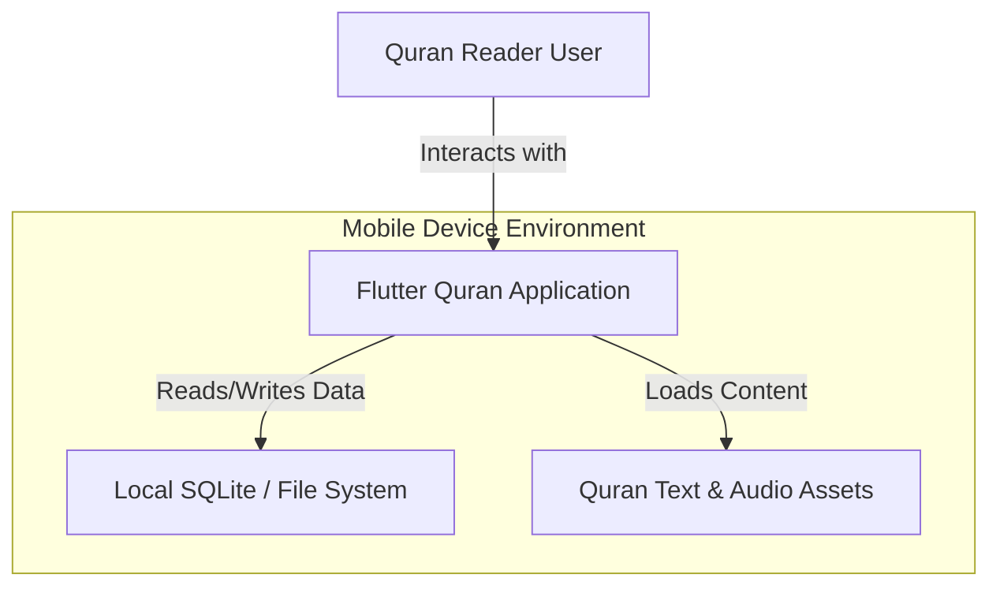
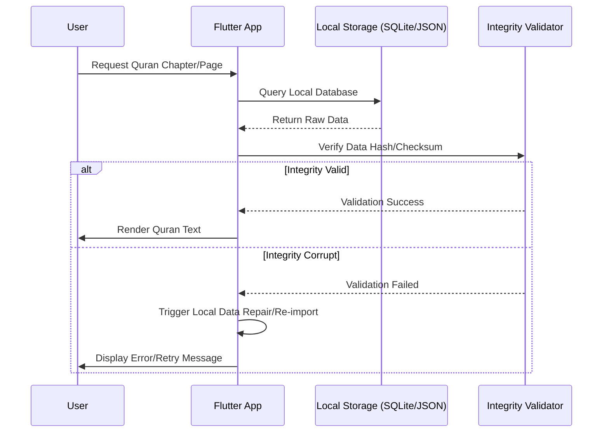
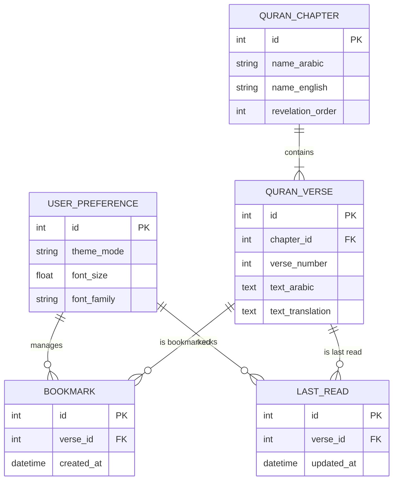
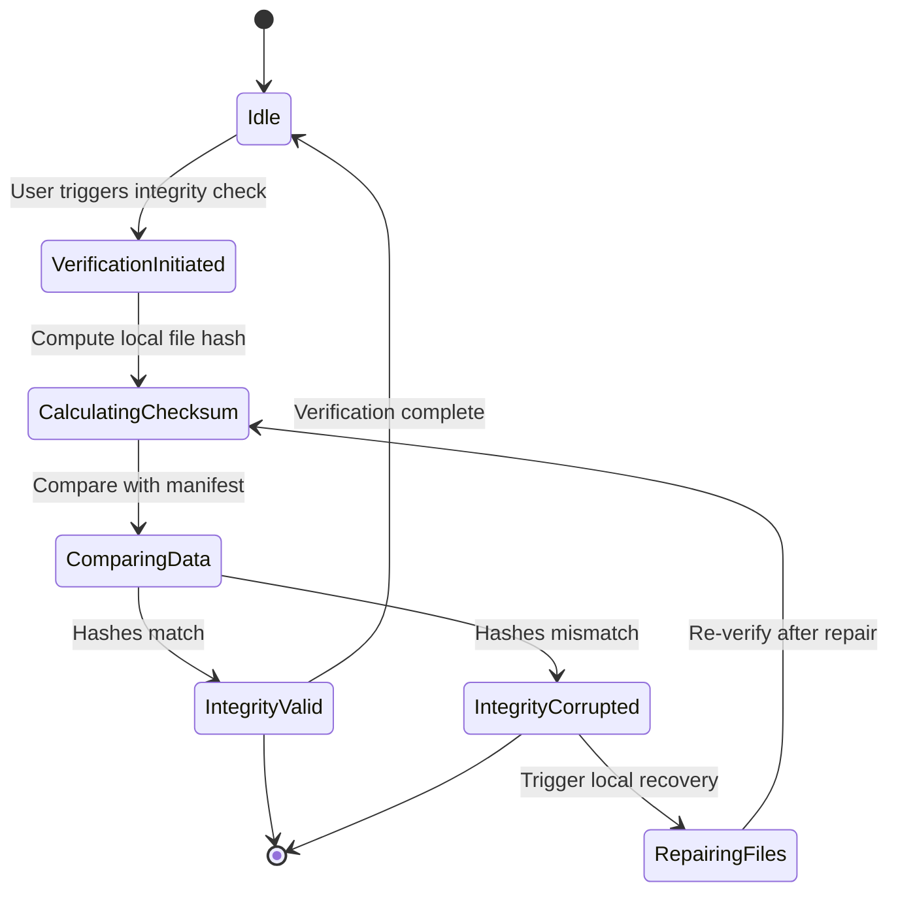

# Software Requirements Specification for Islamic Quran Reading Application

**Standard:** IEEE 830-1998 Aligned SRS Document  
**Generated On:** 2026-09-13 03:39:36 UTC  
**Target Audience:** Software Engineers, Mobile Developers, QA Engineers, and System Architects  
**System Vision:** A mobile application built with Flutter to provide users with a digital interface for reading the Quran, focusing on accessibility and ease of use. The application is strictly limited to local-only storage with no cloud-based identity management or cross-device synchronization.

---

## Table of Contents
- [Introduction](#introduction)
- [Overall Description](#overall-description)
- [System Features & Functional Requirements](#system-features--functional-requirements)
- [External Interface Requirements](#external-interface-requirements)
- [Non-Functional & Quality Attributes](#non-functional--quality-attributes)
- [Document Traceability & Diagram Manifest](#document-traceability--diagram-manifest)

---

## Introduction

## 1.0 Introduction

### 1.1 Purpose
The purpose of this Software Requirements Specification (SRS) is to define the functional and non-functional requirements for the Islamic Quran Reading Application. This document serves as the primary reference for the development team, stakeholders, and quality assurance personnel to ensure the delivery of a high-quality, accessible, and reliable mobile tool for reading the Quran. This application is designed as a strictly local-only mobile utility, prioritizing user privacy and offline accessibility.

### 1.2 Scope
The project involves the development of a cross-platform mobile application using the **Flutter framework**, targeting both iOS and Android ecosystems. 

The scope of the application is limited to:
*   Providing a digital interface for reading, navigating, and studying the Quran.
*   Ensuring 100% offline functionality by bundling the initial dataset within the application binary (see [FR-005]).
*   Managing user-specific data (bookmarks and reading progress) exclusively via local storage mechanisms (e.g., SQLite or Hive).
*   Verifying the integrity of the Quranic text sourced from the authoritative provider, *xyz* (see [FR-004]).

**Exclusions:** This application will not implement cloud-based identity management, user accounts, or cross-device synchronization. All data remains resident on the user's device.

### 1.3 Definitions, Acronyms, and Abbreviations
| Term | Definition |
| :--- | :--- |
| **Ayah** | A verse of the Quran. |
| **Flutter** | The UI toolkit used for building natively compiled applications for mobile. |
| **Juz** | A division of the Quran into 30 parts. |
| **Local-Only** | Architecture where all data persistence occurs on the device without external server communication. |
| **Surah** | A chapter of the Quran. |
| **xyz** | The authoritative Content Provider for the verified Quranic text dataset. |

### 1.4 Stakeholders
*   **Quran Reader:** The primary end-user who accesses the application to read, navigate, and study the Quran. The system is designed to prioritize their reading experience and data privacy.
*   **Content Provider:** The authoritative source (*xyz*) responsible for providing the verified Quranic text dataset, which the application must validate for integrity and accuracy (see [FR-004]).

### 1.5 References
*   [2.0] Overall Description
*   [3.0] System Features & Functional Requirements
*   [4.0] External Interface Requirements
*   [5.0] Non-Functional & Quality Attributes

---

## Overall Description

## 2.0 Overall Description

This section provides a high-level overview of the Islamic Quran Reading Application, defining its operational context, architectural constraints, and the fundamental assumptions governing its development.

### 2.1 Product Perspective
The application is designed as a standalone, offline-first mobile utility. Unlike traditional digital reading platforms, this application operates entirely within the local environment of the user's device. It is architected to function without reliance on external servers, cloud-based identity management, or cross-device synchronization services. By design, the application prioritizes user privacy and accessibility by ensuring that all reading progress, bookmarks, and personal configurations remain strictly on the local device.

### 2.2 Product Functions
The application provides the following core capabilities:
*   **Quranic Text Rendering:** High-fidelity display of the Quranic text (see [FR-001]).
*   **Navigation:** Intuitive access to Surahs and Juz (see [FR-002]).
*   **Local Persistence:** Secure, offline-only storage for user data (see [FR-003]).
*   **Integrity Assurance:** Automated verification of the Quranic text dataset (see [FR-004]).
*   **Immediate Availability:** Zero-latency access to the text via bundled binary assets (see [FR-005]).

### 2.3 User Characteristics
The application is intended for a single primary actor:
*   **Quran Reader:** An end-user seeking a reliable, distraction-free interface for reading and studying the Quran. The user requires no technical expertise, as the application is designed for immediate use upon installation.

### 2.4 Operating Environment
The application is developed using the **Flutter framework**, ensuring a consistent experience across the following platforms:
*   **iOS:** Compatible with current stable versions of iOS.
*   **Android:** Compatible with current stable versions of Android.

### 2.5 Design and Implementation Constraints
The development of this application is subject to the following mandatory constraints:
*   **Framework:** Must be developed using the Flutter framework.
*   **Storage:** Data persistence must be handled via local-only storage solutions (e.g., SQLite or Hive).
*   **Identity Management:** Cloud-based identity management, user accounts, and cloud synchronization are strictly prohibited.
*   **Data Source:** The application must utilize the `xyz` dataset as the authoritative source for all Quranic text.
*   **Deployment:** The initial dataset must be bundled within the application binary to ensure full functionality upon the first launch without requiring an internet connection.

### 2.6 Assumptions and Dependencies
The following assumptions have been made regarding the development and lifecycle of the application:
1.  **Dataset Availability:** It is assumed that the `xyz` dataset remains available and maintained as an authoritative, open-source reference.
2.  **Integrity Mechanisms:** It is assumed that the `xyz` source provides reliable mechanisms for integrity verification, such as SHA-256 hash values or digital signatures, to satisfy [FR-004].
3.  **Offline-First Paradigm:** The application assumes that the user's primary use case is offline, and therefore, no features requiring persistent network connectivity will be implemented.

### 2.7 Summary of Constraints and Requirements
| Category | Requirement/Constraint | Reference |
| :--- | :--- | :--- |
| **Architecture** | Flutter Framework | Section 2.4 |
| **Storage** | Local-only (SQLite/Hive) | [FR-003] |
| **Security** | No Cloud Identity/Sync | [FR-003] |
| **Integrity** | Checksum/Signature Validation | [FR-004] |
| **Deployment** | Bundled Initial Dataset | [FR-005] |

### Architectural Model: System Context Architecture

---

## System Features & Functional Requirements

## [3.0] System Features & Functional Requirements

This section defines the functional requirements for the Quran Reading Application. These requirements are categorized by system capability and are designed to support the primary actor, the **Quran Reader**, while adhering to the constraints of a local-only, offline-first architecture.

### 3.1 Reading Interface
The reading interface is the core component of the application, responsible for the presentation of the Quranic text.

*   **[FR-001] Quran Text Display**
    *   **Description:** The application shall display the full text of the Quran in Arabic script.
    *   **Priority:** Must Have
    *   **Acceptance Criteria:**
        *   Text is rendered correctly using standard Arabic fonts.
        *   Users can scroll through Surahs and Ayahs.

### 3.2 Navigation System
The navigation system provides the user with the ability to traverse the Quranic text efficiently.

*   **[FR-002] Navigation System**
    *   **Description:** The application shall provide a navigation mechanism to select specific Surahs or Juz.
    *   **Priority:** Must Have
    *   **Acceptance Criteria:**
        *   User can select a Surah from a list.
        *   User can jump to a specific Ayah.

### 3.3 Data Management
Data management encompasses the local storage of the Quranic text and user-generated metadata. Per the project constraints, all data management is strictly local.

*   **[FR-003] Offline Data Management**
    *   **Description:** The application shall store Quranic text locally for offline access and manage user-specific data such as bookmarks and reading progress. No cloud-based synchronization or user accounts are supported.
    *   **Priority:** Must Have
    *   **Acceptance Criteria:**
        *   Quranic text is accessible without an active internet connection.
        *   Bookmarks and reading progress are saved locally on the device only.
        *   No external cloud account creation or login functionality exists.
*   **[FR-005] Initial Dataset Acquisition**
    *   **Description:** The application shall bundle the initial Quranic text dataset within the application binary to ensure immediate availability upon first launch.
    *   **Priority:** Must Have
    *   **Acceptance Criteria:**
        *   Application is fully functional without requiring an initial download.
        *   Dataset is included in the app package.

### 3.4 Integrity Verification
To ensure the sanctity and accuracy of the text, the application implements strict verification protocols for the dataset provided by the **Content Provider (xyz)**.

*   **[FR-004] Data Integrity Verification**
    *   **Description:** The application shall verify the integrity and accuracy of the Quranic text sourced from xyz during installation and updates.
    *   **Priority:** Must Have
    *   **Acceptance Criteria:**
        *   Checksum validation performed on downloaded text files.
        *   Digital signature verification of the source dataset.
        *   Error notification to user if integrity check fails.

---

### Summary of Functional Requirements

| ID | Title | Priority | Primary Actor |
| :--- | :--- | :--- | :--- |
| [FR-001] | Quran Text Display | Must Have | Quran Reader |
| [FR-002] | Navigation System | Must Have | Quran Reader |
| [FR-003] | Offline Data Management | Must Have | Quran Reader |
| [FR-004] | Data Integrity Verification | Must Have | Content Provider |
| [FR-005] | Initial Dataset Acquisition | Must Have | Quran Reader |

*Note: For technical implementation details regarding local storage (SQLite/Hive) and UI rendering, refer to [4.0] External Interface Requirements and the project's architectural constraints.*

### Architectural Model: Offline Data Acquisition and Integrity Workflow

### Architectural Model: Local Storage Domain Model

### Architectural Model: Data Integrity Verification State Machine

---

## External Interface Requirements

## [4.0] External Interface Requirements

This section defines the requirements for the interfaces between the Islamic Quran Reading Application and its external environment, including the user, the local storage engine, and the authoritative data source.

### 4.1 User Interfaces (UI)
The application interface is designed to facilitate a distraction-free reading experience, adhering to mobile-first design patterns. The UI must support the functional requirements defined in [FR-001] and [FR-002].

*   **Reading View:** The primary interface shall prioritize the Arabic text display. It must support vertical scrolling and touch-based navigation to ensure a seamless reading flow.
*   **Navigation Drawer/Menu:** A persistent or easily accessible navigation component shall allow the *Quran Reader* to jump between Surahs and Juz.
*   **Accessibility:** The UI must support system-level font scaling and high-contrast modes to ensure readability for all users.
*   **Mobile Patterns:** The interface shall utilize standard Flutter navigation patterns (e.g., `Navigator` or `GoRouter`) to ensure intuitive back-navigation and state management.

### 4.2 Software Interfaces
The application relies on specific software components for data persistence and integrity verification.

#### 4.2.1 Local Storage Engine
To satisfy the offline-first constraint and [FR-003], the application shall interface with a local NoSQL or Relational database engine.

| Component | Technology | Purpose |
| :--- | :--- | :--- |
| **Primary Storage** | Hive or SQLite | Persistent storage for Quranic text, bookmarks, and reading progress. |
| **Data Access Layer** | Flutter Repository Pattern | Abstracts the storage engine from the UI, ensuring the app remains agnostic to the underlying database implementation. |

*   **Persistence Requirements:** All user-specific data (bookmarks, progress) must be stored in the device's local application directory. No data shall be transmitted to external servers.
*   **Initialization:** The application must initialize the storage engine upon the first launch, populating it with the bundled dataset as per [FR-005].

#### 4.2.2 Authoritative Dataset (xyz)
The application integrates with the *xyz* dataset to ensure the accuracy of the Quranic text.

*   **Data Format:** The application expects the *xyz* dataset to be provided in a structured format (e.g., JSON or SQLite dump) compatible with the Flutter asset pipeline.
*   **Integrity Verification Interface:** As per [FR-004], the application shall implement a verification module that interfaces with the *xyz* metadata (checksums/signatures).
    *   **Verification Trigger:** The verification process must execute during the initial app installation and upon any subsequent data updates.
    *   **Failure Handling:** If the integrity check fails, the application shall notify the *Quran Reader* and prevent the loading of corrupted text to maintain the sanctity of the content.

### 4.3 Communication Interfaces
The application operates in an offline-first mode. There are no requirements for network-based communication interfaces (e.g., REST APIs, WebSockets) for user identity or data synchronization. 

*   **Network Usage:** The application shall not require an active internet connection for core functionality. Any network access is strictly limited to optional, non-critical updates of the *xyz* dataset, which must be handled via secure, verified channels.

---

## Non-Functional & Quality Attributes

## [5.0] Non-Functional & Quality Attributes

This section defines the quality attributes and non-functional requirements for the Quran Reading Application. These requirements are critical to ensuring the application meets its objective of providing a reliable, accessible, and secure digital reading experience in an offline-first environment.

### 5.1 Quality Attribute Summary

The following table summarizes the key performance and quality metrics required for the system.

| Attribute | Metric | Target |
| :--- | :--- | :--- |
| **Usability** | Task Completion Rate | > 95% |
| **Performance** | Initial Screen Load Time | < 2.0 Seconds |
| **Reliability** | Data Loss Rate | < 0.01% |
| **Security** | Dataset Verification Success | 100% |

---

### 5.2 Detailed Non-Functional Requirements

#### [NFR-001] Usability
The application shall provide an intuitive interface designed for ease of navigation and extended reading sessions.
*   **Requirement:** The UI/UX design must adhere to standard mobile reading patterns to minimize cognitive load.
*   **Metric:** User task completion rate (e.g., navigating to a specific Surah or setting a bookmark) must exceed 95% during usability testing.

#### [NFR-002] Performance
The application shall maintain high responsiveness to ensure a seamless reading experience, particularly when accessing large volumes of text.
*   **Requirement:** The application must optimize local database queries (see Section 3.0, [FR-003]) to ensure rapid content retrieval.
*   **Metric:** The initial screen load time, including the rendering of the Quranic text, must be less than 2 seconds on supported mobile hardware.

#### [NFR-003] Reliability
Given the offline-first architecture, the application must guarantee the persistence of user-specific data, such as reading progress and bookmarks.
*   **Requirement:** Local storage mechanisms (e.g., SQLite or Hive) must be implemented with robust transaction handling to prevent corruption.
*   **Metric:** The system shall maintain a data loss rate of less than 0.01% for locally stored user metadata.

#### [NFR-004] Security and Integrity
The application must ensure the absolute authenticity of the Quranic text provided by the authoritative source (xyz).
*   **Requirement:** The application must perform cryptographic verification of the dataset as defined in [FR-004].
*   **Metric:** The system must achieve a 100% verification success rate for the authorized text source. Any failure in checksum or digital signature validation must trigger an immediate alert to the user and prevent the display of unverified content.

---

### 5.3 Offline-First Architectural Implications
All non-functional attributes are governed by the constraint that the application operates in a strictly local-only environment. 

1.  **Independence:** Performance and reliability metrics are independent of network latency or availability, as all data is bundled with the binary ([FR-005]) or stored locally ([FR-003]).
2.  **Data Integrity:** Because there is no cloud-based synchronization, the security of the Quranic text relies entirely on the initial verification process performed at installation or update.
3.  **Resource Management:** To maintain the < 2s load time ([NFR-002]), the application must manage local indexing efficiently, ensuring that the local database does not degrade in performance as the user's reading history grows.

---

## Document Traceability & Diagram Manifest

| Diagram ID | Diagram Title | Syntax | Status | Target Section |
|---|---|---|---|---|
| `diag-001` | System Context Architecture | `mermaid` | ✅ Validated | Section 2.0 |
| `diag-002` | Offline Data Acquisition and Integrity Workflow | `mermaid` | ✅ Validated | Section 3.0 |
| `diag-003` | Local Storage Domain Model | `mermaid` | ✅ Validated | Section 3.0 |
| `diag-004` | Data Integrity Verification State Machine | `mermaid` | ✅ Validated | Section 3.0 |